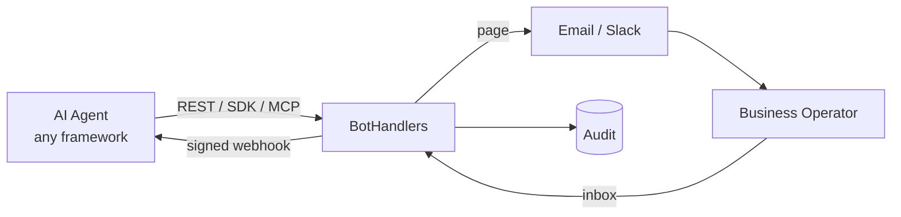
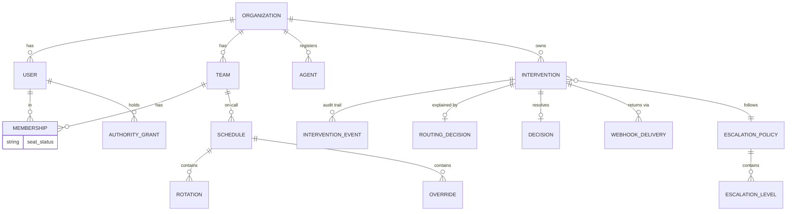
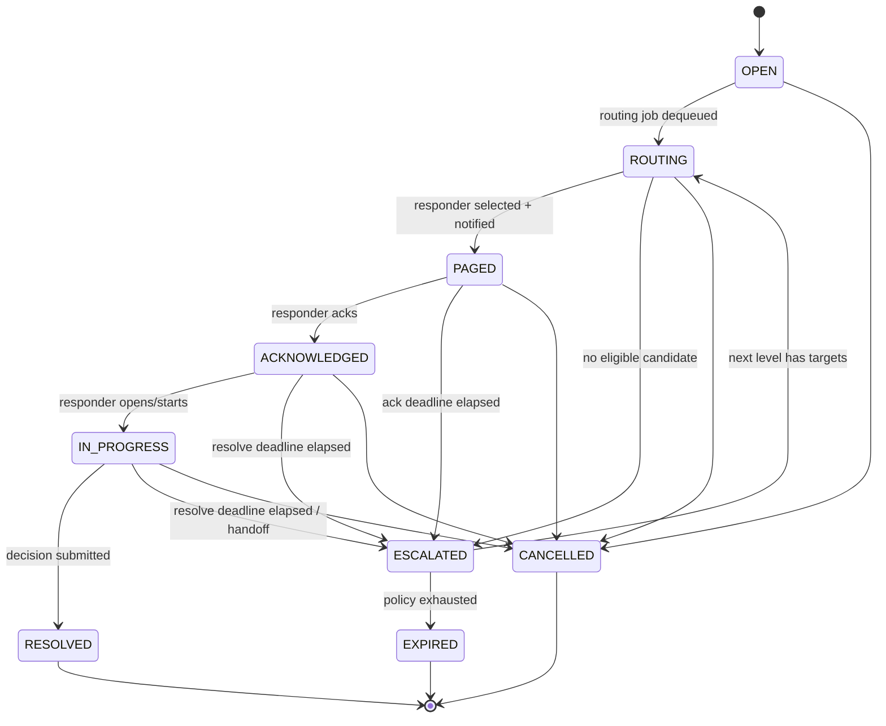
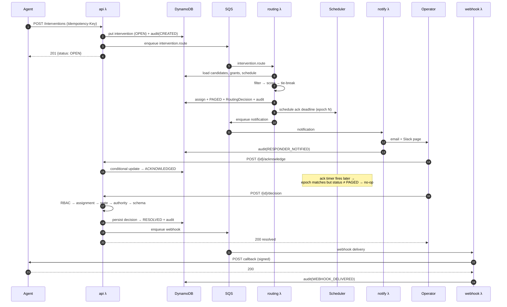

# BotHandlers Architecture

> **Status:** Design — pre-MVP
> **Scope:** The system architecture, data model, state machine, routing algorithm, API surface and delivery guarantees for BotHandlers.
> **Product source of truth:** [`vission.md`](./vission.md). Where product intent and this document disagree, `vission.md` wins on *what* and *why*; this document wins on *how*.
>
> The serverless, event-driven choice ([ADR-001](#adr-001-serverless-event-driven-over-modular-monolith)) is settled and reflected in `vission.md` §17 and [`agents.md`](./agents.md).

## 0. How To Read This Document

Sections 1–2 are the *drivers*: what the system must guarantee and which decisions were made to guarantee it. Sections 3–5 describe *shape*. Sections 6–15 are the *concrete designs* an implementer builds from — data model, state machine, routing, authority, API, delivery. Sections 16–21 are *operating rules*. Section 22 lists what is still undecided.

Normative language: **MUST** / **MUST NOT** are invariants; violating one is a bug. **SHOULD** is a strong default requiring justification to break. **MAY** is discretionary.

---

## 1. Scope and Responsibilities

BotHandlers is a multi-tenant SaaS for human escalation of AI-agent workflows: *a human-in-the-loop management platform*.

The core workflow is:

**AI Agent → Intervention → Policy/Authority Check → Route Human → Notify → Acknowledge → Decide → Escalate if Needed → Return Decision → Audit**

### 1.1 Ownership Boundary

| BotHandlers owns | BotHandlers does not own |
|---|---|
| Intervention lifecycle and durable state | Agent execution, checkpointing, or resumption |
| Routing to a qualified, available, authorized human | The agent's own reasoning or model calls |
| Paging, acknowledgement, SLA and escalation | The business system the decision affects |
| Capturing a structured human decision | Executing the decided action |
| Reliable return of that decision to the caller | The customer's webhook endpoint availability |
| The immutable audit trail | Ticketing, project management, CRM |

The originating agent runtime owns agent execution. BotHandlers owns human intervention orchestration. This boundary is what keeps the platform framework-independent.

### 1.2 Architectural Invariants

These are the non-negotiable properties. Every design decision below traces to one of them.

| # | Invariant |
|---|---|
| I1 | BotHandlers MUST never silently lose an intervention. |
| I2 | BotHandlers MUST never silently lose a human decision. |
| I3 | Every human decision MUST be authenticated, authorized, attributable and auditable. |
| I4 | Every decision MUST map to the correct originating agent execution. |
| I5 | Every tenant-owned operation MUST be tenant-scoped; tenant boundaries are security boundaries. |
| I6 | Async handlers MUST tolerate duplicate delivery. |
| I7 | Scheduled handlers MUST tolerate stale, late and superseded timers. |
| I8 | Concurrent human actions MUST resolve to exactly one accepted outcome. |
| I9 | Routing decisions MUST be explainable after the fact. |
| I10 | Agent frameworks MUST remain integration adapters, never core dependencies. |
| I11 | Business logic MUST NOT be duplicated across REST, MCP, workers or timers. |
| I12 | Human operators MUST NOT need to understand agent frameworks, LLMs, MCP or callbacks. |
| I13 | Identity providers MUST remain interchangeable; adding or replacing one MUST NOT change authorization behavior. |
| I14 | The local development emulator MUST be replaceable without application code changes. |
| I15 | Connected agents MUST NOT be billed per agent on paid plans. |
| I16 | Intervention capacity MUST be a single pool owned by the organization, never partitioned per user. |
| I17 | Exceeding an organization's billing allowance MUST never drop, delay, or block a human escalation. |

The system MUST assume as normal operating conditions: duplicate events happen, timers arrive late, humans race each other, external providers fail, webhook targets are temporarily unavailable, and Lambda invocations retry.

### 1.3 Non-Functional Targets

Design targets for MVP. These size the data model and concurrency choices; they are not SLAs to customers yet.

| Dimension | Target | Rationale |
|---|---|---|
| Intervention create → paged | p95 < 5s | The human's clock starts at page; routing latency eats SLA budget. |
| API read latency | p95 < 200ms | Inbox must feel immediate. |
| Decision persist → webhook enqueued | p95 < 1s | Persist-then-enqueue is synchronous only through the write. |
| Webhook first attempt | < 5s after decision | Agent resume should feel instant on the happy path. |
| Timer accuracy (SLA/escalation) | ±60s | EventBridge Scheduler granularity; SLAs MUST be defined in minutes, not seconds. |
| Interventions/org/day | 10k sustained, 100k burst | Sizes partition strategy. |
| Active (unresolved) per org | 10k | Sizes the sparse "active" index. |
| Audit retention | ≥ 7 years, configurable | Compliance driver; audit is a business record. |
| Idle cost | Near zero | Serverless requirement — see ADR-001. |

**Timer granularity is a product constraint, not just a technical one.** Acknowledgement SLAs MUST be expressed in whole minutes with a minimum of 1 minute; the API MUST reject sub-minute SLAs rather than silently under-deliver.

---

## 2. Key Architectural Decisions

Each decision records the tradeoff accepted and the signal that should trigger revisiting it.

#### ADR-001: Serverless, event-driven over modular monolith

**Decision:** AWS Lambda + API Gateway + SQS + EventBridge Scheduler, with no permanently running workers.

**Rationale:** The workload is bursty and mostly idle — an intervention is created, then the system waits minutes to hours for a human. Paying for idle capacity to wait on humans is the wrong cost shape. The waiting is done by *durable state plus a timer*, not by a held process.

**Tradeoff accepted:** No in-process shared cache; cold starts on low-traffic paths; local development requires emulation; distributed-systems complexity (idempotency, duplicate delivery, stale timers) is pushed onto every handler rather than contained in one process.

**Revisit if:** sustained throughput makes per-invocation cost exceed reserved capacity, or cold-start latency breaches the paging target.

> **A Lambda invocation MUST NOT wait for a human.** This is the single most load-bearing consequence of ADR-001.
>
> ```text
> Create intervention → persist state → route + notify → Lambda exits
>                                                            ↓
>                        human responds later → new request/event → new invocation
> ```

#### ADR-002: DynamoDB as authoritative store

**Decision:** DynamoDB is the production source of truth, modeled from access patterns.

**Rationale:** Access patterns are known, narrow and key-driven (inbox by assignee, queue by status, timeline by intervention). Conditional writes give us I8 (exactly-one outcome under races) without a transaction coordinator. Scales to burst without capacity planning.

**Tradeoff accepted:** Analytics queries (§17 metrics, `vission.md` §14) are *not* natural in DynamoDB — they require a fan-out to a separate analytics path. Ad-hoc querying during incidents is harder. Schema evolution is a code concern, not a migration concern.

**Revisit if:** analytics requirements outgrow the fan-out path, or access patterns become genuinely ad-hoc.

**Consequence:** The analytics store is a *derived* read model, never a second source of truth.

#### ADR-003: Authority modeled separately from RBAC

**Decision:** Two independent authorization systems — RBAC for platform access, Authority Grants for business decision power. See §9.

**Rationale:** This is the product's core differentiator (`vission.md` §6). Collapsing them into roles forces role explosion (`finance_operator_under_500k`) and makes limits unauditable.

**Tradeoff accepted:** Two systems to reason about; every decision path must consult both.

#### ADR-004: Persist-then-enqueue for all outbound effects

**Decision:** State is committed before any notification, webhook or downstream effect is enqueued. No request path synchronously depends on an external provider.

**Rationale:** Directly serves I1 and I2. A decision that was accepted but not yet delivered is a *recoverable* state; a decision lost because the customer's endpoint was down is not.

**Tradeoff accepted:** Eventual delivery; the caller sees "accepted", not "delivered".

#### ADR-005: One logical Lambda per concern, not per endpoint

**Decision:** Seven logical functions (§4.3), not one function per route.

**Rationale:** Per-endpoint functions multiply cold starts, IAM policies and deploy surface with no isolation benefit. Per-concern functions still allow independent memory, timeout, concurrency and least-privilege IAM where those genuinely differ.

**Tradeoff accepted:** A noisy endpoint shares a function with quiet ones. Mitigated by reserved concurrency where it matters.

#### ADR-006: Explainable rule-based routing, not learned scoring

**Decision:** Routing is deterministic filter-then-score with a persisted decision record (§8).

**Rationale:** I9. An operations manager must be able to ask "why Priya?" and get a real answer. It is also a prerequisite for the long-term autonomy-control-plane goal (`vission.md` §15) — you cannot evaluate whether a human was needed if you cannot reconstruct why that human was chosen.

**Tradeoff accepted:** No adaptive optimization in V1.

#### ADR-007: Credentials are verified inside the application, not at an API Gateway authorizer

**Decision:** A single identity middleware in the API function classifies the incoming credential — human bearer token verified against the provider's public keys, or agent API key resolved by hash lookup — and constructs the tenant context. No API Gateway JWT authorizer.

**Rationale:** One function serves both humans and agents (per the one-function-per-concern rule), and a Gateway JWT authorizer structurally cannot validate an opaque `bh_live_…` key. Splitting them across two layers means tenant context is constructed in two places, which defeats the lint rule that makes tenancy enforcement structural rather than remembered. Verifying in one middleware also makes revocation immediate rather than bounded by an authorizer cache TTL.

**Alternatives considered:** Gateway JWT authorizer for human routes plus in-function key auth for agent routes (rejected, two auth paths at two layers); single Lambda REQUEST authorizer handling both (rejected, extra hop and cold start on every request).

#### ADR-008: Usage metering is asynchronous and never gates the intervention path

**Decision:** Seat counts and intervention consumption are computed on the derived analytics path from the audit event stream. The intervention creation path performs no quota check and no usage write.

**Rationale:** The invariant that exceeding a billing allowance must never drop a human escalation is much stronger than a policy — it is a statement that billing state must not be able to fail an intervention. If creation consulted a counter, that counter becomes a dependency of the critical path, and a metering bug or a hot counter partition becomes an outage of the product's core promise. Counting after the fact makes overage a billing event rather than a runtime condition.

**Consequence:** Usage figures are eventually consistent, and warning notifications are threshold-triggered from the derived model rather than transactional.

---

## 3. Tech Stack

### Primary Technologies

| Layer | Technology | Responsibility |
|---|---|---|
| Primary language | TypeScript | Backend, frontend, infrastructure, SDK |
| Web | Next.js | Marketing site + authenticated application |
| Mobile | React Native + Expo | Operator mobile experience |
| Public docs app | Docusaurus | Renders external documentation |
| API framework | Hono | Thin HTTP routing layer for Lambda |
| Validation/contracts | Zod | Runtime validation and shared contracts |
| API specification | OpenAPI | Public REST API definition |
| Backend compute | AWS Lambda | API and event-driven execution |
| API ingress | Amazon API Gateway | REST/HTTP entrypoint |
| Database | Amazon DynamoDB | Authoritative application state |
| Queue | Amazon SQS | Durable asynchronous work |
| Dead-letter queues | Amazon SQS DLQ | Failed asynchronous work |
| Timers | Amazon EventBridge Scheduler | SLA and escalation deadlines |
| Email | Provider abstraction | Transactional email; provider can change independently |
| Logs/metrics | Amazon CloudWatch | Runtime logs and operational metrics |
| Tracing | OpenTelemetry | Distributed tracing |
| Infrastructure as code | Pulumi + TypeScript | Reproducible cloud environments |
| AWS SDK | AWS SDK for JavaScript v3 | AWS service integration |
| Lambda utilities | AWS Lambda Powertools for TypeScript | Logging, metrics, tracing, idempotency |
| Local AWS emulator | Floci | Local development and integration testing |
| Testing | Vitest | Unit and integration tests |
| CI/CD | GitHub Actions | Test, build, infrastructure deploy |

**Python SDK note:** TypeScript is the primary implementation language, but the Python SDK is a first-class deliverable — the agent ecosystem (LangGraph, CrewAI, PydanticAI, AutoGen) is predominantly Python. The Python SDK is generated-and-hand-polished from the OpenAPI spec, and its ergonomics are a product requirement, not an afterthought.

---

## 4. System Architecture

### 4.1 Context



### 4.2 Runtime Shape

Synchronous:

```text
API Gateway → API Lambda → Hono → Application Services → Domain → AWS Adapters
```

Asynchronous:

```text
SQS → Worker Lambda → Application Services → Domain
```

Timers:

```text
EventBridge Scheduler → Timer Lambda → Application Services
```

### 4.3 Logical Functions

| Function | Trigger | Responsibility | Concurrency profile |
|---|---|---|---|
| `api` | API Gateway | REST surface for agents and humans | Broad |
| `mcp` | API Gateway | MCP transport | Broad |
| `routing-worker` | SQS | Candidate selection, assignment | Scale with queue |
| `notification-worker` | SQS | Page delivery via providers | Provider rate-aware |
| `escalation-worker` | EventBridge Scheduler | SLA expiry, escalation advance | Low, spiky |
| `webhook-worker` | SQS | Signed callback delivery + retries | Target rate-aware |
| `analytics-worker` | DynamoDB Streams / SQS | Derived read models, metrics | Batch-tolerant |

Do not create one Lambda function per REST endpoint unless runtime isolation is justified (ADR-005).

### 4.4 Layering and Dependency Rules

```text
Transport / Runtime  →  Application  →  Domain  →  Ports / Interfaces  →  Infrastructure adapters
```

- `apps/*` MAY depend on `packages/*`.
- `sdk/*` MAY depend on public contracts; MUST NOT depend on backend internals.
- `api`, `mcp` and `workers` MUST remain thin adapters.
- Domain logic MUST NOT depend on: AWS SDKs, Hono, Lambda event types, Floci, or any agent framework.
- Framework integrations are adapters only.
- Identity providers MUST be accessed through a port with one adapter per provider; adding or replacing an identity provider MUST NOT require changes to the domain layer.
- Shared contracts belong in `packages/contracts`.
- Core business logic belongs in `backend/domain` and `backend/application`.

**Enforcement:** these rules MUST be enforced mechanically (dependency-cruiser or ESLint boundary rules) in CI, not by review discipline. A rule that is only social is a rule that erodes.

---

## 5. Domain Model

### 5.1 Entities



### 5.2 Identifier Scheme

Prefixed, opaque, URL-safe identifiers — Stripe-style, because developer experience is a stated goal (`vission.md` §18).

| Prefix | Entity |
|---|---|
| `org_` | Organization |
| `usr_` | User |
| `tem_` | Team |
| `agt_` | Agent |
| `int_` | Intervention |
| `evt_` | Intervention event (audit) |
| `dec_` | Decision |
| `rte_` | Routing decision |
| `esc_` | Escalation policy |
| `sch_` | Schedule |
| `grt_` | Authority grant |
| `whd_` | Webhook delivery |
| `key_` | API key (identifier only; secret is never stored) |

IDs MUST be generated as prefix + 24 characters of base62 randomness (≥128 bits entropy). IDs MUST NOT encode tenant identity — tenancy comes from the authenticated context (§16.1), never from the identifier.

### 5.3 The Intervention

The central object. Fields, grouped by purpose:

```ts
type Intervention = {
  // Identity & origin
  intervention_id: InterventionId;
  organization_id: OrganizationId;
  agent_id: AgentId;
  agent_version: string | null;
  external_run_id: string | null;      // correlates to the agent's own run
  idempotency_key: string | null;

  // The situation (human-facing, business language)
  title: string;                        // one line an operator understands
  description: string;
  severity: "low" | "medium" | "high" | "critical";
  business_context: Record<string, unknown>;  // records, amounts, customers

  // What the agent thinks
  agent_recommendation: string | null;
  confidence: number | null;            // 0..1

  // What is asked of the human
  requested_action: string;
  response_schema: ResponseSchema;      // §11.5

  // Routing requirements
  required_team_id: TeamId | null;
  required_skills: string[];
  required_authority: AuthorityRequirement | null;  // §9.3

  // Timing & ownership
  ack_sla_minutes: number;
  resolve_sla_minutes: number | null;
  assigned_user_id: UserId | null;
  escalation_policy_id: EscalationPolicyId | null;
  escalation_level: number;             // 0-based; current level
  escalation_epoch: number;             // increments on every advance — see §10.5

  // Return path
  callback: { url: string; secret_ref: string } | null;

  // State
  status: InterventionStatus;
  lifecycle_group: "ACTIVE" | "CLOSED"; // derived; drives sparse indexes
  version: number;                      // optimistic concurrency
  final_decision: Decision | null;

  // Timestamps (all ISO-8601 UTC)
  created_at: string;
  routed_at: string | null;
  paged_at: string | null;
  acknowledged_at: string | null;
  resolved_at: string | null;
  ack_deadline_at: string | null;
  resolve_deadline_at: string | null;
};
```

`lifecycle_group`, `version`, `escalation_epoch` and the `*_deadline_at` fields are infrastructure-bearing: they exist to make the data model, concurrency control and timer safety work, and are derived rather than client-supplied.

---

## 6. Data Model (DynamoDB)

### 6.1 Method

Access patterns first, then keys, then indexes. Relational habits MUST NOT drive the model, and single-table cleverness MUST NOT be pursued for its own sake — a small number of clearly bounded tables is preferred where it improves maintainability.

The physical model MUST satisfy three principles:
1. Tenant identity participates in keys. Every tenant-owned item MUST carry `organization_id`, and every key MUST be prefixed with it so that a missing tenant scope is a *malformed key*, not a data leak.
2. Indexes preserve tenant isolation. A query across a GSI MUST remain bounded to a single organization.
3. No production request path scans.

The model in §6.2–§6.7 satisfies these principles natively without requiring a separate table per organization.

### 6.2 Access Pattern Catalog

| # | Access pattern | Table | Index | Key |
|---|---|---|---|---|
| A1 | Get intervention by id | `interventions` | base | PK=`ORG#<org>` SK=`INT#<id>` |
| A2 | Inbox: assigned to me, active | `interventions` | GSI1 | PK=`ORG#<org>#ASSIGNEE#<usr>` SK begins `ACTIVE#` |
| A3 | Inbox: my resolved history | `interventions` | GSI1 | PK=same SK begins `CLOSED#` |
| A4 | Org queue by status (unacked, in progress, escalated) | `interventions` | GSI2 | PK=`ORG#<org>#STATUS#<status>` SK=`<deadline>#<id>` |
| A5 | Team queue | `interventions` | GSI3 | PK=`ORG#<org>#TEAM#<tem>` SK=`<group>#<deadline>` |
| A6 | By agent (analytics, debugging) | `interventions` | GSI4 | PK=`ORG#<org>#AGENT#<agt>` SK=`<created_at>` |
| A7 | Correlate by external run id | `interventions` | GSI5 | PK=`ORG#<org>#RUN#<external_run_id>` |
| A8 | All active interventions (sweeps, reconciliation) | `interventions` | GSI6 (sparse) | PK=`ORG#<org>#ACTIVE` SK=`<deadline>` |
| A9 | Audit timeline for an intervention | `intervention_events` | base | PK=`INT#<id>` SK=`<seq>` |
| A10 | Org-wide audit by day (Auditor role) | `intervention_events` | GSI1 | PK=`ORG#<org>#DAY#<yyyy-mm-dd>` SK=`<ts>#<evt>` |
| A11 | Directory lookup (user/team/agent) | `directory` | base | PK=`ORG#<org>` SK=`USER#<id>` \| `TEAM#<id>` \| `AGENT#<id>` |
| A12 | Team membership → members | `directory` | base | PK=`ORG#<org>` SK begins `MEMBER#<tem>#` |
| A13 | User → teams | `directory` | GSI1 | PK=`ORG#<org>#USER#<usr>` SK begins `MEMBER#` |
| A14 | Authenticate API key | `credentials` | base | PK=`KEYHASH#<sha256>` |
| A15 | Authority grants for a user | `directory` | base | PK=`ORG#<org>` SK begins `GRANT#<usr>#` |
| A16 | Resolve on-call for team at time T | `schedules` | base | PK=`ORG#<org>#SCHED#<sch>` SK=`LAYER#…` / `OVERRIDE#…` |
| A17 | Webhook deliveries for an intervention | `deliveries` | base | PK=`INT#<id>` SK=`ATTEMPT#<n>` |
| A18 | Idempotency replay | `idempotency` | base | PK=`ORG#<org>#IDEM#<key>` (TTL) |

Every pattern above is a `GetItem` or a bounded `Query`. **No production request path may perform a `Scan`.**

### 6.3 Table: `interventions`

```text
PK   ORG#<organization_id>
SK   INT#<intervention_id>
```

Attributes are stored as first-class fields where they drive queries or routing (`status`, `assigned_user_id`, `required_team_id`, `severity`, `ack_deadline_at`, `lifecycle_group`, `version`, `escalation_epoch`). Flexible agent-supplied data (`business_context`, `response_schema`) is stored as document attributes.

**Rule:** a value that appears in a key, a filter or a routing rule MUST be a top-level attribute, never buried inside a JSON blob.

| Index | PK | SK | Projection | Purpose |
|---|---|---|---|---|
| GSI1 | `ORG#<org>#ASSIGNEE#<usr>` | `<lifecycle_group>#<sort_at>#<int_id>` | INCLUDE (inbox fields) | Operator inbox |
| GSI2 | `ORG#<org>#STATUS#<status>` | `<sort_at>#<int_id>` | INCLUDE | Status queues |
| GSI3 | `ORG#<org>#TEAM#<tem>` | `<lifecycle_group>#<sort_at>#<int_id>` | INCLUDE | Team queues |
| GSI4 | `ORG#<org>#AGENT#<agt>` | `<created_at>#<int_id>` | KEYS_ONLY | Per-agent analysis |
| GSI5 | `ORG#<org>#RUN#<external_run_id>` | `<created_at>` | KEYS_ONLY | Agent correlation (I4) |
| GSI6 | `active_pk` (sparse) | `<ack_deadline_at>` | INCLUDE | Active-set sweeps |

`sort_at` = `ack_deadline_at` while active (most urgent first), `resolved_at` once closed (most recent first).

**Sparse index strategy (GSI6).** The `active_pk` attribute is written as `ORG#<org>#ACTIVE` while the intervention is unresolved and **deleted** on transition to a terminal state. DynamoDB omits items lacking the key from the index, so GSI6 contains only live work — bounded by the 10k-active-per-org target rather than by total history. This keeps reconciliation sweeps cheap forever.

GSI1/GSI3 use `lifecycle_group` as the SK prefix rather than a separate index so a single query serves both "my open work" and "my history" with a `begins_with` condition.

**Projections:** inbox indexes project only the fields the list view renders (`title`, `severity`, `status`, `ack_deadline_at`, `agent_id`, `assigned_user_id`). Full `business_context` is fetched on detail view only. Over-projecting doubles storage and write cost on the hottest table.

### 6.4 Table: `intervention_events` (audit)

Append-only. This table is the evidentiary record (I3).

```text
PK   INT#<intervention_id>
SK   <seq:zero-padded-10>#<event_id>
```

Monotonic `seq` per intervention gives a stable, gap-detectable ordering that wall-clock timestamps cannot (two events in the same millisecond, or clock skew across Lambdas). `seq` is allocated from the intervention's `version` counter, which is already advanced under a conditional write — so ordering is free and correct.

| Index | PK | SK | Purpose |
|---|---|---|---|
| GSI1 | `ORG#<org>#DAY#<yyyy-mm-dd>` | `<ts>#<event_id>` | Auditor / compliance export |

**Immutability MUST be enforced at the IAM layer, not in application code.** The roles used by runtime functions are granted `dynamodb:PutItem` with a `attribute_not_exists(PK)` condition and are explicitly denied `UpdateItem` and `DeleteItem` on this table. An immutability guarantee that only exists in application code is not a guarantee.

Event item shape:

```ts
type InterventionEvent = {
  event_id: string;
  intervention_id: InterventionId;
  organization_id: OrganizationId;
  seq: number;
  type: AuditEventType;
  occurred_at: string;
  actor: { kind: "human" | "agent" | "system"; id: string; ip?: string };
  payload: Record<string, unknown>;   // type-specific, redacted per §16.5
  event_version: number;
};
```

Audit event types:

```text
INTERVENTION_CREATED     POLICY_SELECTED         ROUTING_STARTED
ROUTING_COMPLETED        RESPONDER_SELECTED      RESPONDER_NOTIFIED
NOTIFICATION_FAILED      INTERVENTION_ACKNOWLEDGED
INTERVENTION_ESCALATED   ESCALATION_EXHAUSTED    DECISION_SUBMITTED
DECISION_REJECTED        WEBHOOK_DELIVERY_ATTEMPTED
WEBHOOK_DELIVERY_FAILED  WEBHOOK_DELIVERED       WEBHOOK_ABANDONED
INTERVENTION_RESOLVED    INTERVENTION_EXPIRED    INTERVENTION_CANCELLED
```

Every entry MUST be attributable to an actor or an explicit system identity. "System" is an actor, not an absence of one.

### 6.5 Table: `directory`

Organizations, users, teams, agents, memberships and authority grants share one table because they are always read within a single tenant partition and are frequently read together during routing (a routing pass needs team members + their skills + their grants).

```text
PK   ORG#<organization_id>
SK   ORG#META
     USER#<user_id>
     TEAM#<team_id>
     AGENT#<agent_id>
     MEMBER#<team_id>#<user_id>      → role in team, skills, seat_status
     GRANT#<user_id>#<grant_id>      → authority grant
```

| Index | PK | SK | Purpose |
|---|---|---|---|
| GSI1 | `ORG#<org>#USER#<usr>` | `MEMBER#<team_id>` | Reverse membership lookup |
| GSI2 | `EMAIL#<lowercased>` | `ORG#<org>` | Login / invite resolution |

A routing pass fetches candidates with **one `Query` on `MEMBER#<team>#`** plus a batched read of the corresponding `USER#` and `GRANT#` items — bounded, not a scan.

### 6.6 Table: `credentials`

API keys are separated from `directory` because they are looked up by hash *before* tenant context exists — the lookup itself establishes tenancy.

```text
PK   KEYHASH#<sha256(secret)>
```

Attributes: `key_id`, `organization_id`, `agent_id`, `environment` (`test`|`live`), `scopes[]`, `created_at`, `last_used_at`, `revoked_at`.

The plaintext secret is **never** stored — only its hash. Displayed once at creation. See §16.3.

### 6.7 Tables: `schedules`, `policies`, `deliveries`, `idempotency`

| Table | Keys | Notes |
|---|---|---|
| `schedules` | PK=`ORG#<org>#SCHED#<sch>`, SK=`LAYER#<n>` / `OVERRIDE#<from_ts>#<id>` | On-call model, §10.1 |
| `policies` | PK=`ORG#<org>`, SK=`ESCPOL#<id>` / `ROUTEPOL#<id>` | Escalation + routing config |
| `deliveries` | PK=`INT#<id>`, SK=`ATTEMPT#<n>` | Webhook attempt log, §13 |
| `idempotency` | PK=`ORG#<org>#IDEM#<key>`, TTL 24h | Stores result snapshot for replay, §11.7 |

**TTL:** only `idempotency` uses TTL. Interventions and audit events are business records and MUST NOT be TTL-expired; retention is a deliberate archival process (§16.5), never a silent table sweep.

### 6.8 Hot Partitions and Item Size

The `ORG#<org>` partition is the natural hot spot for a large tenant. Mitigations, in order of preference:

1. Reads are served from GSIs whose partition keys already shard by assignee/status/team, not from the base partition.
2. The base table is written once per intervention transition — a few writes per intervention, not a stream.
3. If a single tenant exceeds partition throughput, shard the base PK as `ORG#<org>#<shard>` where shard = `hash(intervention_id) % N`. **This is deliberately deferred** — it complicates A1, and the 10k/day target is far below the threshold.

Item size: `business_context` is agent-supplied and unbounded in principle. The API MUST enforce a limit (proposed: 256 KB total item, with `business_context` capped at 100 KB) and reject oversized payloads with a clear error rather than failing at the DynamoDB boundary. Larger context MUST be passed by reference (URL) rather than by value.

---

## 7. Intervention State Machine

### 7.1 States

```text
OPEN  ROUTING  PAGED  ACKNOWLEDGED  IN_PROGRESS  ESCALATED  RESOLVED  EXPIRED  CANCELLED
```

`RESOLVED`, `EXPIRED` and `CANCELLED` are terminal. `ESCALATED` is transient — it always advances to `PAGED` (next level) or `EXPIRED` (policy exhausted).



### 7.2 Transition Table

This table is the contract. It SHOULD be expressed once in code as data and shared by every caller — REST, MCP, workers and timers (I11).

| From | To | Trigger | Guard | Side effects | Audit event |
|---|---|---|---|---|---|
| — | `OPEN` | `POST /interventions` | Valid payload; agent authenticated; idempotency key unused | Persist; enqueue `intervention.route` | `INTERVENTION_CREATED` |
| `OPEN` | `ROUTING` | `routing-worker` dequeue | Status is `OPEN` or `ESCALATED` | Load policy | `ROUTING_STARTED`, `POLICY_SELECTED` |
| `ROUTING` | `PAGED` | Candidate selected | ≥1 eligible candidate | Assign; set `ack_deadline_at`; schedule ack timer; enqueue notification; persist `RoutingDecision` | `ROUTING_COMPLETED`, `RESPONDER_SELECTED`, `RESPONDER_NOTIFIED` |
| `ROUTING` | `ESCALATED` | No candidate | Zero eligible after filters | Increment level + epoch | `INTERVENTION_ESCALATED` |
| `PAGED` | `ACKNOWLEDGED` | `POST /{id}/acknowledge` | Caller is assignee **or** has `intervention:acknowledge` on the team; status is `PAGED` | Cancel ack timer; set `acknowledged_at`; start resolve timer | `INTERVENTION_ACKNOWLEDGED` |
| `PAGED` | `ESCALATED` | Ack timer fires | `status == PAGED` **and** `epoch == timer.epoch` | Increment level + epoch | `INTERVENTION_ESCALATED` |
| `ESCALATED` | `ROUTING` | Immediate | Next level exists | Re-enqueue `intervention.route` | `ROUTING_STARTED` |
| `ESCALATED` | `EXPIRED` | Immediate | No next level, no fallback | Notify org admins; enqueue `expired` webhook | `ESCALATION_EXHAUSTED`, `INTERVENTION_EXPIRED` |
| `ACKNOWLEDGED` | `IN_PROGRESS` | Operator opens the decision form | Caller is assignee | — | — (state only) |
| `IN_PROGRESS` | `RESOLVED` | `POST /{id}/decision` | Caller is assignee; RBAC allows; **authority covers the decision** (§9); payload validates against `response_schema` | Persist decision **then** enqueue webhook; cancel timers; clear `active_pk` | `DECISION_SUBMITTED`, `INTERVENTION_RESOLVED` |
| `ACKNOWLEDGED` / `IN_PROGRESS` | `ESCALATED` | Resolve timer, or explicit `POST /{id}/escalate` | Resolve SLA configured and elapsed, or caller requests handoff | Increment level + epoch | `INTERVENTION_ESCALATED` |
| any non-terminal | `CANCELLED` | `POST /{id}/cancel` | Caller is originating agent or org admin | Cancel timers; clear `active_pk`; enqueue `cancelled` webhook | `INTERVENTION_CANCELLED` |

**`RESOLVED` is reachable only through the decision path.** There is no administrative shortcut to `RESOLVED` — closing without a decision is `CANCELLED`. This keeps "resolved" meaning "a human decided" for every metric and audit downstream.

### 7.3 Illegal Transitions

The system MUST reject any transition not in the table above. Rejection is a `409 Conflict` with the current state, never a silent no-op — except where the transition is a *duplicate of one already applied*, which returns the current state as success (§7.5).

### 7.4 Concurrency Control

Every transition is a conditional `UpdateItem`:

```ts
await ddb.update({
  Key: { PK: `ORG#${orgId}`, SK: `INT#${interventionId}` },
  UpdateExpression:
    "SET #status = :next, #version = :nextVersion, acknowledged_at = :now",
  ConditionExpression:
    "#status = :expected AND #version = :expectedVersion",
  ExpressionAttributeValues: {
    ":expected": "PAGED",
    ":expectedVersion": current.version,
    ":nextVersion": current.version + 1,
    ":next": "ACKNOWLEDGED",
    ":now": nowIso,
  },
});
```

A `ConditionalCheckFailedException` means someone else won the race. The loser MUST receive a deterministic conflict response describing the actual current state — never a retry loop that eventually double-applies (I8).

Two humans deciding simultaneously: exactly one write succeeds, one decision is recorded, one webhook is sent. The loser is told the intervention was already resolved, and by whom.

### 7.5 Idempotent Re-entry

Terminal and repeat actions MUST be safe to replay:

- Acknowledging an already-acknowledged intervention **by the same user** → `200` with current state, no new audit event.
- Acknowledging by a *different* user → `409`.
- Submitting a decision to a `RESOLVED` intervention with the same idempotency key → `200` with the stored decision.
- With a different key → `409`.

---

## 8. Routing Engine

### 8.1 Requirement

Routing MUST be explainable (I9). For every intervention an operations manager can ask *"why did this go to Priya?"* and receive: who was considered, who was excluded and for which specific reason, how the remainder ranked, and what broke the tie.

### 8.2 Pipeline

```text
Intervention
    ↓
[1] Resolve candidate pool      (team membership, or org-wide if no team required)
    ↓
[2] Hard filters                (skills, authority, availability, on-call, capacity)
    ↓  → excluded candidates recorded with reasons
[3] Score survivors             (weighted, deterministic)
    ↓
[4] Deterministic tie-break
    ↓
[5] Persist RoutingDecision     (the explainability artifact)
    ↓
Assign + page
```

Hard filters are **eliminating**. Scoring MUST NOT resurrect a candidate that failed a filter — an unauthorized person is not "a lower-scoring option", they are ineligible.

### 8.3 Hard Filters

| Filter | Rule | Exclusion reason code |
|---|---|---|
| Team | If `required_team_id` set, candidate MUST be a member | `NOT_IN_TEAM` |
| Skills | Candidate skills MUST be a superset of `required_skills` | `MISSING_SKILL` |
| Authority | An authority grant MUST cover `required_authority` (§9) | `INSUFFICIENT_AUTHORITY` |
| Availability | Local working hours, unless intervention is `critical` | `OUTSIDE_WORKING_HOURS` |
| On-call | At escalation level 0, MUST be on-call for the team now | `NOT_ON_CALL` |
| Capacity | Active assigned count < `max_concurrent` | `AT_CAPACITY` |
| Status | Not deactivated, not on override-excluded leave | `UNAVAILABLE` |
| Self-exclusion | MUST NOT be a responder who already escalated this intervention | `ALREADY_ESCALATED` |

The `ALREADY_ESCALATED` filter prevents the pathological loop where escalation routes back to the person who just escalated.

### 8.4 Scoring

Applied only to candidates surviving §8.3. Weights are org-configurable with these defaults:

| Signal | Weight | Definition |
|---|---|---|
| On-call primary | 0.35 | 1.0 if primary on-call, 0.5 if secondary, 0 otherwise |
| Authority fit | 0.20 | Prefers the *tightest sufficient* grant — avoids burning a CFO on a ₹10k approval |
| Inverse workload | 0.20 | `1 - (active_assigned / max_concurrent)` |
| Skill specificity | 0.15 | Fraction of required skills held as a declared specialty vs. baseline |
| Recent responsiveness | 0.10 | Rolling MTTA percentile over the last 30 days |

**Authority fit deserves emphasis:** the cheapest sufficient authority wins. Routing should not escalate to the highest-authority person available simply because they are eligible; that trains the organization to ignore pages.

Recent responsiveness is the only historical signal in V1 and is capped at 0.10 deliberately — it must not create a feedback loop where the fastest responder absorbs all work.

### 8.5 Tie-Breaking

Ties MUST resolve deterministically, so the same inputs always produce the same assignee (a testability requirement as much as a fairness one):

1. Lowest active workload
2. Longest time since last assignment (round-robin fairness)
3. Lexicographically lowest `user_id`

### 8.6 The Routing Decision Record

Persisted for every routing pass. This is the artifact that satisfies I9 and feeds the long-term autonomy analysis (`vission.md` §15).

```ts
type RoutingDecision = {
  routing_id: RoutingDecisionId;
  intervention_id: InterventionId;
  organization_id: OrganizationId;
  escalation_level: number;
  escalation_epoch: number;
  evaluated_at: string;
  policy_id: string;
  weights: Record<string, number>;      // snapshot — policies change over time
  candidate_pool_size: number;
  considered: Array<{
    user_id: UserId;
    eligible: boolean;
    exclusion_reasons: string[];        // filter codes from §8.3
    scores: Record<string, number>;     // per-signal, when eligible
    total_score: number | null;
  }>;
  selected_user_id: UserId | null;
  tie_break_applied: string | null;
  outcome: "ASSIGNED" | "NO_CANDIDATE" | "FALLBACK_USED";
  duration_ms: number;
};
```

The `weights` snapshot matters: policies are edited, and a decision must remain explainable against the rules that were actually in force at the time.

### 8.7 No Eligible Candidate

Ordered fallback — the system MUST NOT drop the intervention (I1):

1. Retry without the *soft* availability filter (working hours) if severity is `high` or `critical`.
2. Use the escalation level's explicit fallback user.
3. Advance to the next escalation level immediately.
4. If levels are exhausted → `EXPIRED`, notify org admins, fire the `expired` webhook so the agent is not left waiting.

An intervention that cannot be routed is a loud operational event, never a silent one.

### 8.8 Reference Implementation

```ts
async function route(
  intervention: Intervention,
  ctx: TenantContext,
): Promise<RoutingDecision> {
  const policy = await policies.forIntervention(intervention, ctx);
  const level = policy.levels[intervention.escalation_level];

  const pool = await directory.candidatesFor(level.target, ctx);
  const considered: ConsideredCandidate[] = [];

  for (const candidate of pool) {
    const reasons = applyHardFilters(candidate, intervention, level);
    if (reasons.length > 0) {
      considered.push({ user_id: candidate.id, eligible: false, exclusion_reasons: reasons, scores: {}, total_score: null });
      continue;
    }
    const scores = score(candidate, intervention, policy.weights);
    considered.push({
      user_id: candidate.id,
      eligible: true,
      exclusion_reasons: [],
      scores,
      total_score: weightedSum(scores, policy.weights),
    });
  }

  const eligible = considered.filter((c) => c.eligible);
  if (eligible.length === 0) return fallback(intervention, level, considered);

  const selected = breakTies(eligible);   // §8.5 — deterministic
  return persistRoutingDecision({ intervention, policy, considered, selected });
}
```

Routing MUST be a pure function of (intervention, candidates, policy, clock). The clock is injected, never read from ambient `Date.now()` inside the domain — otherwise the algorithm is untestable and on-call resolution cannot be verified across time zones.

---

## 9. Authority Model

### 9.1 RBAC vs Authority

Two independent systems (ADR-003). Both MUST pass.

| | RBAC | Authority |
|---|---|---|
| Answers | *Can this user perform this operation in BotHandlers?* | *Is this user empowered to make this business decision?* |
| Granularity | Operations (`intervention:read`, `schedule:write`) | Business actions with parameters (approve payment ≤ ₹500,000) |
| Assigned via | Roles | Grants |
| Changes when | Job function changes | Delegated authority changes |
| Failure mode | `403 FORBIDDEN` | `403 INSUFFICIENT_AUTHORITY` |

Roles for MVP: **Organization Admin**, **Agent Developer**, **Operations Manager**, **Operator**, **Auditor**.

A Finance Operator may be permitted to view and acknowledge an intervention and still be forbidden from approving a ₹10M transaction. These are different questions with different answers, and conflating them is how compliance failures happen.

### 9.2 Grant Shape

```ts
type AuthorityGrant = {
  grant_id: GrantId;
  organization_id: OrganizationId;
  subject: { kind: "user" | "team"; id: string };
  action: string;                       // namespaced: "finance.payment.approve"
  constraints: Constraint[];            // ALL must be satisfied (AND)
  valid_from: string;
  valid_until: string | null;
  granted_by: UserId;
  granted_at: string;
  revoked_at: string | null;
};

type Constraint = {
  attribute: string;                    // "amount", "currency", "region", "customer_tier"
  operator: "lte" | "gte" | "eq" | "in" | "not_in";
  value: unknown;
};
```

### 9.3 Requirement Shape

Declared by the agent when creating the intervention:

```ts
type AuthorityRequirement = {
  action: string;                       // "finance.payment.approve"
  parameters: Record<string, unknown>;  // { amount: 750000, currency: "INR" }
};
```

### 9.4 Evaluation

**Deny by default.** A grant satisfies a requirement when: the action matches exactly, the grant is currently valid and not revoked, and *every* constraint is satisfied by the requirement's parameters.

A parameter referenced by a constraint but absent from the requirement is a **failure**, not a pass. Missing data must never widen authority.

```ts
function covers(grant: AuthorityGrant, req: AuthorityRequirement, now: Date): AuthorityCheck {
  if (grant.action !== req.action) return deny("ACTION_MISMATCH");
  if (grant.revoked_at) return deny("REVOKED");
  if (now < parse(grant.valid_from)) return deny("NOT_YET_VALID");
  if (grant.valid_until && now > parse(grant.valid_until)) return deny("EXPIRED");

  for (const c of grant.constraints) {
    if (!(c.attribute in req.parameters)) return deny(`MISSING_PARAMETER:${c.attribute}`);
    if (!satisfies(req.parameters[c.attribute], c)) return deny(`CONSTRAINT_FAILED:${c.attribute}`);
  }
  return allow(grant.grant_id, tightness(grant));
}
```

Authority MUST be checked **twice**: at routing time (to build the eligible pool) and again at decision submission (state may have changed — grants get revoked while an intervention sits in an inbox). The second check is the authoritative one.

### 9.5 Worked Example

Priya is in Finance, holds the Operator role, and has:

```json
{
  "action": "finance.payment.approve",
  "constraints": [
    { "attribute": "amount",   "operator": "lte", "value": 500000 },
    { "attribute": "currency", "operator": "eq",  "value": "INR" }
  ]
}
```

| Intervention requires | Outcome |
|---|---|
| `amount: 250000, currency: INR` | ✅ Eligible; routed to Priya |
| `amount: 750000, currency: INR` | ❌ `CONSTRAINT_FAILED:amount` — filtered out at §8.3, escalates to a higher grant |
| `amount: 250000, currency: USD` | ❌ `CONSTRAINT_FAILED:currency` |
| `amount` omitted | ❌ `MISSING_PARAMETER:amount` — deny, not allow |

If she is paged for a ₹250k approval and the agent later amends it to ₹750k, the decision-time re-check (§9.4) rejects her submission with `INSUFFICIENT_AUTHORITY` and the intervention re-routes rather than recording an unauthorized approval.

---

## 10. On-Call, SLA and Escalation

### 10.1 Schedule Model

```ts
type Schedule = {
  schedule_id: ScheduleId;
  organization_id: OrganizationId;
  team_id: TeamId;
  timezone: string;                     // IANA, e.g. "Asia/Kolkata"
  layers: Layer[];                      // higher index = higher precedence
};

type Layer = {
  layer_id: string;
  name: string;                         // "Primary", "Secondary"
  rotation: {
    type: "daily" | "weekly" | "custom";
    length_hours: number;
    handoff_time: string;               // "09:00" in schedule timezone
    start_at: string;                   // rotation epoch
  };
  participants: UserId[];               // rotation order
  restrictions: TimeRestriction[];      // e.g. weekdays 09:00–18:00 only
};

type Override = {
  override_id: string;
  schedule_id: ScheduleId;
  user_id: UserId | null;               // null = "nobody" (coverage gap, explicit)
  from: string;
  until: string;
  reason: string;
};
```

### 10.2 Resolution Algorithm

`resolveOnCall(schedule, at) → { primary, secondary[] }`

1. Convert `at` to the schedule's IANA timezone (**never** the server's, and never a fixed offset — DST correctness depends on this).
2. For each layer, high precedence first:
   a. Check overrides covering `at` → if found, that layer resolves to the override's user (or nobody).
   b. Otherwise compute rotation position: `floor((at - rotation.start_at) / length_hours) % participants.length`.
   c. Apply time restrictions; if `at` falls outside, the layer yields nobody.
3. Highest-precedence non-empty layer → primary. Remaining → secondary.
4. If every layer is empty → coverage gap; return the schedule's fallback user and emit a `coverage_gap` metric.

Rotation position is computed arithmetically from an epoch rather than by materializing shifts. Materialized shifts drift, need backfilling, and break when a rotation is edited retroactively.

**A coverage gap MUST be visible before it matters.** The system SHOULD surface gaps proactively (upcoming-gap alerting), because discovering one at page time means the SLA clock is already running.

### 10.3 SLA Clocks

| Clock | Starts at | Ends at | On expiry |
|---|---|---|---|
| Acknowledgement | `paged_at` (per level — resets on escalation) | `acknowledged_at` | Escalate |
| Resolution | `created_at` (does **not** reset) | `resolved_at` | Escalate or flag breach |

The acknowledgement clock resets per escalation level — each newly paged human gets a fair window. The resolution clock does not — it measures the business's total exposure, which escalation does not reduce. MTTA and MTTR (`vission.md` §14) are computed from exactly these fields.

### 10.4 Escalation Policy Model

```ts
type EscalationPolicy = {
  policy_id: EscalationPolicyId;
  organization_id: OrganizationId;
  name: string;
  levels: EscalationLevel[];
  repeat_count: number;                 // re-run levels N times before EXPIRED
  on_exhausted: "expire" | "notify_admins" | "both";
};

type EscalationLevel = {
  level: number;
  target:
    | { kind: "schedule"; schedule_id: ScheduleId }
    | { kind: "team"; team_id: TeamId }
    | { kind: "user"; user_id: UserId }
    | { kind: "authority"; action: string; min_scope: Constraint[] };
  ack_timeout_minutes: number;
  notification_channels: ChannelKind[];  // escalate the *channel* too: email → slack → SMS
  fallback_user_id: UserId | null;
};
```

The `authority` target kind is what makes the ₹500k case work automatically: level 0 targets the on-call schedule, level 1 targets *anyone with authority covering this specific amount* — no hand-maintained list of approvers per threshold.

### 10.5 Timer Mechanics and the Epoch Guard

Each page schedules a one-time EventBridge Scheduler invocation:

```text
Human paged
    ↓ schedule ack deadline (name: ack-<intervention_id>-<epoch>)
Deadline fires
    ↓
escalation-worker
    ↓ reload intervention from DynamoDB
    ↓
Still PAGED and epoch matches?
    ├── no  → no-op (log, emit metric, exit)
    └── yes → escalate
```

**Scheduled events MUST always re-read authoritative state before acting.** A timer firing after acknowledgement MUST be harmless (I7).

The `escalation_epoch` counter makes this robust in a way that status-checking alone does not. Consider: level 0 pages Priya (epoch 5, timer A). Priya escalates manually → epoch 6, level 1 pages Raj, timer B. Timer A now fires late. Status is `PAGED` — a naive status check would escalate *again*, skipping Raj's window entirely. The epoch mismatch (`5 ≠ 6`) causes a clean no-op.

Timers SHOULD be deleted on state change, but deletion is an optimization, never a correctness requirement — the epoch guard is the correctness mechanism. Best-effort cleanup keeps the scheduler tidy; the guard keeps the system correct.

---

## 11. API Design

### 11.1 Conventions

- Base path `/v1`. Breaking changes ship a new major path; additive changes do not.
- JSON only. `snake_case` fields (matches the Python SDK's idiom without translation).
- All timestamps ISO-8601 UTC with `Z`.
- Cursor pagination; offsets are never exposed.
- Every response carries `request_id` for support correlation.

### 11.2 Authentication

Human and agent authentication are fundamentally separate paths. Neither can assume the other's privileges, and attempting to use an agent credential for a human operation (like submitting a decision) is rejected.

| Caller | Mechanism | Establishes |
|---|---|---|
| Agent | `Authorization: Bearer bh_live_…` | org + agent + environment + scopes |
| Human (web/mobile) | OIDC identity token → BotHandlers session token | active org + user + roles |
| MCP client | Bearer API key, same as agent | org + agent + environment + scopes |

**Agent Credentials:**
An agent API key resolves deterministically to one organization, one registered agent, one environment (`live` or `test`), and a set of scopes. A `bh_test_…` credential MUST NOT create production interventions, and MUST NOT page real humans — test-mode interventions route to a sandbox responder and never dispatch real notifications. Accidentally paging a real operator from a test suite would destroy trust in the pager itself.

**Human Identity and Identity Providers:**
Human identity is asserted by an OIDC provider. BotHandlers is vendor-neutral and supports Google, GitHub, Okta, Entra ID, and Keycloak out of the box. The identity provider asserts *who* the user is, but **claims from the identity provider grant no permissions in BotHandlers**. Adding, replacing, or removing a provider MUST NOT change authorization behavior. Roles, memberships, and authority grants are resolved solely from BotHandlers' own records on each request.

**Identity-to-Session Exchange:**
The provider issues an OIDC identity token. Because a user may hold membership in multiple organizations but every request must operate in exactly one, BotHandlers exchanges the provider's token for its own short-lived session token. This BotHandlers session token carries the user identity and the *active organization* for the current request.

**Multi-Organization Membership:**
A user can belong to multiple organizations. When authenticating, they select an active organization. Any request made using that session token operates strictly within that active organization. If a client attempts to supply a different organization identifier in a request payload, the system MUST use the active organization from the session token instead, or reject the request entirely. Accessing resources from an organization other than the active one is impossible.

### 11.3 Endpoints

**Agent-facing**

| Method | Path | Purpose |
|---|---|---|
| `POST` | `/v1/interventions` | Create an intervention |
| `GET` | `/v1/interventions/{id}` | Poll status + decision |
| `POST` | `/v1/interventions/{id}/cancel` | Agent no longer needs the decision |
| `GET` | `/v1/interventions?external_run_id=` | Correlate to an agent run |

**Human-facing**

| Method | Path | Purpose |
|---|---|---|
| `GET` | `/v1/interventions?view=assigned_to_me\|unacknowledged\|in_progress\|escalated\|resolved` | Inbox views |
| `POST` | `/v1/interventions/{id}/acknowledge` | Take ownership |
| `POST` | `/v1/interventions/{id}/decision` | Submit structured decision |
| `POST` | `/v1/interventions/{id}/escalate` | Hand off / cannot decide |
| `GET` | `/v1/interventions/{id}/events` | Timeline |
| `GET` | `/v1/interventions/{id}/routing` | *Why me?* — the routing decision, in plain language |

**Configuration** — `/v1/teams`, `/v1/users`, `/v1/agents`, `/v1/schedules`, `/v1/escalation-policies`, `/v1/authority-grants`, `/v1/webhooks`, `/v1/api-keys` (standard CRUD, Operations Manager or Admin).

The `GET /routing` endpoint is a product feature, not a debug route: an operator who is paged at 2am deserves to know why it was them.

### 11.4 Create Intervention

```http
POST /v1/interventions
Authorization: Bearer bh_live_…
Idempotency-Key: run_8f2a-step_14
```

```json
{
  "title": "Refund request above auto-approval limit",
  "description": "Customer ORD-88213 requests a full refund of ₹742,000 for a cancelled bulk order. Auto-approval covers up to ₹500,000.",
  "severity": "high",
  "external_run_id": "run_8f2a",
  "business_context": {
    "order_id": "ORD-88213",
    "customer": "Meridian Textiles",
    "amount": 742000,
    "currency": "INR",
    "customer_tier": "enterprise",
    "reason_code": "SUPPLIER_CANCELLATION"
  },
  "agent_recommendation": "Approve full refund; supplier cancelled, customer is not at fault.",
  "confidence": 0.82,
  "requested_action": "Approve, reject or modify this refund.",
  "required_team": "tem_finance_ops",
  "required_skills": ["refunds"],
  "required_authority": {
    "action": "finance.payment.approve",
    "parameters": { "amount": 742000, "currency": "INR" }
  },
  "ack_sla_minutes": 15,
  "resolve_sla_minutes": 120,
  "response_schema": { "...": "see §11.5" },
  "callback": { "url": "https://acme.example.com/hooks/bothandlers" }
}
```

`201 Created` returns the intervention with `status: "OPEN"`. Creation is deliberately **not** synchronous with routing — persist first, route asynchronously (ADR-004). The response is a durable receipt.

Note what the operator will see: business language, real amounts, a named customer. Nothing about models, prompts or frameworks (I12). The API shape enforces this — there is no field for agent internals, and there should not be.

### 11.5 Response Schema and Decisions

Agents declare the shape of a valid answer. A constrained subset of JSON Schema — constrained because the UI must render it as a form a non-technical operator can complete without instruction.

```json
{
  "type": "object",
  "decision_options": ["APPROVE", "REJECT", "MODIFY", "REQUEST_MORE_INFORMATION"],
  "fields": [
    { "name": "approved_amount", "type": "number", "label": "Approved amount (₹)",
      "required_when": { "decision": ["APPROVE", "MODIFY"] }, "max": 742000 },
    { "name": "reason_code", "type": "enum", "label": "Reason",
      "options": ["SUPPLIER_FAULT", "GOODWILL", "POLICY_EXCEPTION"], "required": true },
    { "name": "note", "type": "text", "label": "Note to the customer", "required": false }
  ]
}
```

Submission:

```http
POST /v1/interventions/int_.../decision
Idempotency-Key: dec_op_44_attempt_1
```

```json
{
  "decision": "MODIFY",
  "fields": { "approved_amount": 600000, "reason_code": "POLICY_EXCEPTION",
              "note": "Approving ₹600,000; ₹142,000 shipping is non-refundable per contract." },
  "rationale": "Contract §7 excludes shipping from refunds."
}
```

Validation order at submission — **all must pass**, and the order matters because each failure is a different remediation:

1. RBAC → `403 FORBIDDEN`
2. Assignment (is this the assignee?) → `403 NOT_ASSIGNED`
3. State (is it decidable?) → `409 INVALID_STATE`
4. Authority re-check (§9.4) → `403 INSUFFICIENT_AUTHORITY`
5. Payload vs `response_schema` → `422 SCHEMA_VALIDATION_FAILED`

Supported schema types are deliberately limited to `string`, `number`, `boolean`, `enum`, `text`, `date`. Nested objects and arrays are **not** supported in V1 — they cannot be rendered as a comprehensible form for a non-technical operator, and an unrenderable schema is a product failure, not a flexibility win.

### 11.6 Error Envelope

```json
{
  "error": {
    "type": "insufficient_authority",
    "code": "CONSTRAINT_FAILED:amount",
    "message": "Your approval authority covers up to ₹500,000. This decision requires ₹742,000.",
    "detail": { "required": 742000, "your_limit": 500000, "currency": "INR" },
    "request_id": "req_01HX…",
    "docs_url": "https://docs.bothandlers.com/errors/insufficient_authority"
  }
}
```

Error types map to §19.4's classification. Messages surfaced to operators MUST be plain business language — the example above tells Priya exactly why and by how much, with no reference to grants, constraint operators or schema paths.

### 11.7 Idempotency

`Idempotency-Key` is **required** on all mutating agent-facing endpoints and SHOULD be supplied on human-facing mutations.

Semantics: first request executes and stores `(status, response_body, request_fingerprint)` for 24h. A replay with the same key and same fingerprint returns the stored response with `Idempotency-Replayed: true`. Same key, *different* body → `409 IDEMPOTENCY_KEY_REUSE`. A concurrent replay while the first is in flight → `409 IDEMPOTENCY_IN_PROGRESS`.

This is what makes an agent's own retry loop safe — the most likely source of duplicate interventions is a retrying agent, not a network fault.

### 11.8 Rate Limiting

Token bucket per `(organization_id, key_id)`, enforced at the API Lambda against a DynamoDB counter with `429` + `Retry-After`. Separate, more generous buckets for human sessions than agent keys. Creating interventions has a distinct, lower limit than reads — a runaway agent loop is the realistic abuse case, and it should hit a wall before it floods an operator's inbox.

---

## 12. MCP Surface

MCP is a **transport**, not a domain. Handlers MUST call the same application services as REST (I11). No business logic may exist only in an MCP handler.

| MCP tool | Maps to | Notes |
|---|---|---|
| `human.request` | `POST /interventions` | Generic; caller supplies full `response_schema` |
| `human.review` | `POST /interventions` | Preset schema: `APPROVE`/`REJECT` + note |
| `human.choose` | `POST /interventions` | Preset: enum of caller-supplied options |
| `human.approve` | `POST /interventions` | Preset: binary + optional authority requirement |
| `human.request_information` | `POST /interventions` | Preset: free-text/typed fields, no approval semantics |
| `human.takeover` | `POST /interventions` | Severity elevated; requests full human ownership |
| `human.escalate` | `POST /{id}/escalate` | Forces level advance |
| `human.status` | `GET /{id}` | Poll for resolution |

The presets are the point: `human.approve` is `human.request` with a schema the platform fills in. Convenience lives in the transport layer; semantics live in the domain.

---

## 13. Webhook / Callback Delivery

This is where I2 is won or lost.

### 13.1 Contract

```http
POST https://acme.example.com/hooks/bothandlers
BH-Event-Id: whd_01HX…
BH-Event-Type: intervention.resolved
BH-Signature: t=1739577600,v1=5257a869e7…
BH-Delivery-Attempt: 1
```

```json
{
  "event_id": "whd_01HX…",
  "event_type": "intervention.resolved",
  "event_version": 1,
  "created_at": "2026-08-14T18:20:00Z",
  "data": {
    "intervention_id": "int_…",
    "external_run_id": "run_8f2a",
    "status": "RESOLVED",
    "decision": {
      "decision": "MODIFY",
      "fields": { "approved_amount": 600000, "reason_code": "POLICY_EXCEPTION" },
      "rationale": "Contract §7 excludes shipping from refunds.",
      "decided_by": { "user_id": "usr_…", "name": "Priya S.", "email": "…" },
      "decided_at": "2026-08-14T18:19:52Z",
      "authority_grant_id": "grt_…"
    }
  }
}
```

Event types: `intervention.resolved`, `intervention.expired`, `intervention.cancelled`, `intervention.escalated` (optional subscription), `intervention.acknowledged` (optional).

`external_run_id` is echoed at the top of `data` because it is the agent's join key (I4) — it must not require digging.

### 13.2 Signature

HMAC-SHA256 over `"{timestamp}.{raw_body}"` using the endpoint's signing secret; header format `t=<unix>,v1=<hex>`. Receivers MUST compare in constant time and MUST reject timestamps outside a ±5 minute tolerance to prevent replay. Multiple `v1=` values MAY appear during secret rotation — both are valid during the overlap window, which is what makes rotation possible without downtime.

### 13.3 Retry Schedule

| Attempt | Delay after previous | Cumulative |
|---|---|---|
| 1 | immediate | 0 |
| 2 | 30s | 30s |
| 3 | 2m | ~2.5m |
| 4 | 10m | ~13m |
| 5 | 1h | ~1.2h |
| 6 | 6h | ~7h |
| 7 | 24h | ~31h |

Full jitter is applied to every delay. Success = HTTP 2xx. `4xx` other than `408`/`429` is **non-retryable** (the payload is wrong; retrying cannot fix it) — abandon immediately and alert. `5xx`, `408`, `429` and network errors are retryable.

After attempt 7 the delivery is `ABANDONED`: `WEBHOOK_ABANDONED` audit event, org admin alert, and the decision remains available via `GET /interventions/{id}` and manual replay. **A decision is never lost — at worst it is undelivered and loudly flagged** (I2).

### 13.4 Ordering and Idempotency

Deliveries are **not** ordered. Receivers MUST use `event_id` for idempotency and `data.status` for state, not arrival order. This is documented prominently in the public docs — assumed ordering is the most common integration bug in webhook systems.

### 13.5 Observability

`GET /v1/interventions/{id}/deliveries` exposes every attempt with status code, response snippet, timing and next scheduled retry. `POST /v1/interventions/{id}/deliveries/replay` re-attempts manually. Failing endpoints are surfaced in the UI as an operational problem for the *customer's* engineering team — silence here would let a broken integration accumulate undelivered decisions unnoticed.

---

## 14. Asynchronous Architecture

### 14.1 Event Envelope

Every SQS message uses one envelope. Tenant context is mandatory (I5) and re-validated on load.

```json
{
  "event_id": "evt_01HX…",
  "event_version": 1,
  "type": "intervention.route",
  "organization_id": "org_abc",
  "intervention_id": "int_789",
  "occurred_at": "2026-08-14T18:00:00Z",
  "trace_id": "…",
  "payload": {}
}
```

`event_version` is mandatory from day one. Rolling deployments mean a queue always contains messages produced by the previous version; consumers MUST handle every supported prior version rather than assuming their own.

### 14.2 Queue Catalog

| Queue | Producer | Consumer | Visibility | Max receives | DLQ |
|---|---|---|---|---|---|
| `intervention-routing` | api, escalation-worker | routing-worker | 60s | 3 | ✅ |
| `notifications` | routing-worker | notification-worker | 120s | 5 | ✅ |
| `webhooks` | api (decision), escalation-worker | webhook-worker | 300s | 1 per attempt* | ✅ |
| `audit-fanout` | all | analytics-worker | 60s | 5 | ✅ |
| `analytics` | analytics-worker | analytics-worker | 300s | 3 | ✅ |

\* Webhook retries are **application-scheduled** (§13.3), not SQS-redrive — the schedule spans 31 hours, far beyond SQS's 15-minute maximum delay. Each attempt is a discrete message; SQS redrive covers only infrastructure failure of the attempt itself.

Every queue MUST have: visibility timeout, retry policy, DLQ, CloudWatch alarm on depth *and* on oldest-message-age, and a named owner.

### 14.3 Consumer Requirements

SQS delivery is at-least-once; **duplicate processing MUST be assumed** (I6). Every consumer MUST:

1. Re-read authoritative state before acting — never trust the message payload as current.
2. Re-validate tenant ownership against the loaded item.
3. Apply changes via conditional write (§7.4).
4. Treat "already applied" as success, not error.

Visibility timeout MUST exceed the p99 handler duration, or the message is redelivered mid-processing and the duplicate is self-inflicted.

### 14.4 Error Classification

| Class | Handling |
|---|---|
| Validation | Non-retryable → DLQ immediately |
| Authentication / Authorization | Non-retryable → DLQ |
| Authority violation | Non-retryable → surfaced to user, audited |
| Conflict (state moved on) | Usually success — re-read and no-op |
| Retryable dependency failure | Retry with backoff |
| Non-retryable dependency failure | DLQ + alarm |
| Internal error | Retry once, then DLQ |

Poison messages MUST reach a DLQ rather than loop forever. DLQ depth > 0 is an alarm, and DLQs MUST be inspectable and replayable through operational tooling. A failed notification or webhook MUST NOT disappear silently.

---

## 15. The Critical Path

Everything above exists to make this one flow reliable. It is the acceptance test for the MVP.



Step 4 is deliberate: the agent gets a durable receipt before routing runs. Steps 15–19 are the ordering that protects I2 — persist, *then* enqueue.

**MVP definition of done:** this path works end to end, plus every failure test in §20.6 passes. Nothing else in this document is a prerequisite for that. Do not over-engineer secondary functionality until this flow is reliable.

---

## 16. Security

### 16.1 Tenancy Enforcement

Every tenant-owned operation MUST execute with tenant context derived from authenticated credentials. **Never trust a client-supplied `organization_id`.**

```ts
type TenantContext = {
  organizationId: string;
  actor:
    | { kind: "human"; userId: string; roles: string[] }
    | { kind: "agent"; agentId: string; environment: "live" | "test"; scopes: string[] };
};

getIntervention(ctx.organizationId, interventionId)   // good
getIntervention(interventionId)                       // forbidden
```

Enforcement is structural rather than remembered:

1. Repository methods MUST take `TenantContext` as their first parameter — a signature that cannot be called without tenancy.
2. Keys are constructed from `ctx.organizationId`, so a cross-tenant read produces a key miss, not a leak.
3. Async messages carry `organization_id`; consumers re-validate it against the loaded item.
4. A lint rule forbids constructing a `TenantContext` outside the authentication middleware, guaranteeing tenancy is bound at the edge.

### 16.2 Human vs Agent Authentication

Humans: identity provider / session, organization membership, RBAC. Agents: scoped API keys, organization, agent identity, environment. These are separate paths with separate token shapes. An agent credential can never acquire a human's RBAC roles, and a human credential cannot assume an agent role. Attempting to use an agent credential for an operation reserved for humans (such as submitting a decision) is rejected as forbidden. The `TenantContext` union isolates these identities cleanly so that downstream logic cannot accidentally interpret one as the other.

### 16.3 API Keys

Format `bh_{test|live}_{24 chars base62}`. Only `sha256(secret)` is stored (§6.6); the plaintext is shown once. Keys are scoped to an agent and environment, support instant revocation, and record `last_used_at` for staleness auditing. Key material MUST NOT appear in logs, URLs, error messages or audit payloads.

### 16.4 Secrets

Webhook signing secrets and email provider credentials live in AWS Secrets Manager, referenced by ARN (`secret_ref`), never inlined into DynamoDB items. Signing secrets support two-secret rotation windows (§13.2).

### 16.5 PII and Retention

`business_context` is agent-supplied and *will* contain customer PII — this is unavoidable, since it is exactly what the human needs to decide.

- Encrypted at rest (DynamoDB KMS, customer-managed key per tenant where required).
- Never logged. Structured logs carry identifiers only; a redaction allowlist governs which fields may appear in audit payloads.
- Retention configurable per org, minimum 7 years for audit records.
- Deletion requests (GDPR/DPDP): `business_context` is redactable in place while the audit event chain is preserved — *that a decision occurred, by whom and when* survives redaction of *what data it concerned*. Erasing the audit chain itself would defeat I3.

Audit records and human decisions are critical business records. Retention policy MUST be explicit and documented before production customer data is stored.

### 16.6 Abuse

Rate limits (§11.8), per-org budget alarms, anomaly alerting on intervention creation rate. A runaway agent creating thousands of interventions is a foreseeable failure mode and MUST hit a limit before it floods an operator inbox — operator trust in the pager is the product.

---

## 17. Observability

### 17.1 Structured Logging

Every log line SHOULD carry: `request_id`, `event_id`, `organization_id`, `intervention_id`, `agent_id`, `function`, `operation`, `trace_id`.

Never log: secrets, credentials, raw API keys, or `business_context` payloads.

### 17.2 Metrics

**Infrastructure:** API request count, 4xx, 5xx, latency; Lambda errors, duration, throttles; SQS depth, oldest message age; DLQ count.

**Business** (these map directly to `vission.md` §14):

```text
interventions_created / resolved / escalated / expired
human_intervention_rate
MTTA, MTTR
sla_compliance_rate
escalation_rate
routing_no_candidate_count
coverage_gap_count
notification_failures
webhook_failures, webhook_retry_count, webhook_abandoned
agent_confidence_vs_human_decision
```

The last one is the seed of the autonomy control plane (`vission.md` §15): where the agent was confident and the human agreed, repeatedly, is where autonomy may eventually be safe. V1 only *records* this — no automation.

### 17.3 Alarms

| Alarm | Threshold | Why |
|---|---|---|
| DLQ depth | > 0 | Something is silently stuck (I1/I2) |
| `webhook_abandoned` | > 0 | A decision is undelivered |
| `routing_no_candidate` | > 0 | Interventions cannot reach a human |
| `coverage_gap` | > 0 | Nobody is on call |
| Oldest message age | > 5 min | Async pipeline is falling behind |
| SLA breach rate | > 10% | Operational or staffing failure |

Use OpenTelemetry-compatible instrumentation where possible; trace context propagates through SQS message attributes so an intervention is traceable end to end across function boundaries.

---

## 18. Repository Structure

```text
bot-handlers/
├── architecture.md
├── vission.md
│
├── apps/
│   ├── web/                       # Next.js marketing + authenticated product
│   ├── mobile/                    # React Native + Expo
│   └── docs/                      # Docusaurus application
│
├── backend/
│   ├── api/
│   │   ├── handler.ts             # API Gateway/Lambda entrypoint
│   │   └── routes/
│   │
│   ├── mcp/
│   │   ├── handler.ts
│   │   └── tools/
│   │
│   ├── workers/
│   │   ├── routing/
│   │   ├── notifications/
│   │   ├── escalations/
│   │   ├── webhooks/
│   │   └── analytics/
│   │
│   ├── application/               # Use cases; the only layer transports may call
│   │   ├── organizations/  users/  teams/  agents/
│   │   ├── interventions/  decisions/  policies/
│   │   ├── routing/  authority/  schedules/  escalations/
│   │   └── notifications/  webhooks/  audit/  analytics/
│   │
│   ├── domain/                    # Pure business logic; no AWS, no HTTP, no framework
│   │   ├── organizations/  users/  teams/  agents/
│   │   ├── interventions/         # state machine lives here
│   │   ├── decisions/  policies/
│   │   ├── routing/               # filter + score + tie-break
│   │   ├── authority/             # grant evaluation
│   │   └── schedules/  escalations/
│   │
│   └── infrastructure/
│       ├── aws/{dynamodb,sqs,scheduler,cloudwatch,secrets}/
│       ├── email/
│       └── repositories/
│
├── packages/
│   ├── contracts/                 # Shared Zod schemas/types only
│   ├── ui/  config/  utilities/
│
├── sdk/
│   ├── python/                    # First-class: the agent ecosystem is Python
│   └── typescript/
│
├── docs/                          # External/public content rendered by apps/docs
│   ├── getting-started/  concepts/  guides/
│   ├── api/  sdk/  mcp/  integrations/  webhooks/
│
├── infrastructure/
│   ├── pulumi/{components,stacks}/
│   └── local/docker-compose.yml   # Floci
│
├── scripts/
├── tests/{integration,e2e,fixtures}/
├── package.json
├── pnpm-workspace.yaml
└── turbo.json
```

`docs/` is external documentation only. Internal architecture documentation MUST NOT be placed there; `architecture.md` and `vission.md` remain at the repository root.

---

## 19. Development Guidelines

### 19.1 TypeScript

Strict mode MUST be enabled. Avoid `any`. Prefer branded domain types over bare strings, so a `UserId` cannot be passed where an `OrganizationId` is expected:

```ts
type OrganizationId = string & { readonly __brand: "OrganizationId" };
type InterventionId = string & { readonly __brand: "InterventionId" };
```

Plain aliases (`type UserId = string`) document intent but catch nothing. Given that tenancy is a security boundary (I5), the compiler should be enforcing it.

Use Zod at transport and integration boundaries only. Zod schemas MUST NOT substitute for domain behavior.

### 19.2 Boundaries

Lambda handlers, MCP tools, queue consumers and scheduler handlers MUST be thin. They may: parse input, authenticate, establish tenant context, validate transport contracts, call application services, serialize output. They MUST NOT contain domain rules.

### 19.3 Testability

Domain code MUST NOT read ambient time, randomness or environment. Clock, ID generation and configuration are injected. Routing and on-call resolution are otherwise untestable across time zones and DST boundaries — and those are exactly the cases that fail in production.

### 19.4 Error Classification

Errors MUST be classified as: validation, authentication, authorization, **authority violation**, conflict, retryable dependency failure, non-retryable dependency failure, internal error. Async handlers MUST distinguish retryable from non-retryable (§14.4).

Authority violation is deliberately distinct from authorization: they produce different user-facing messages, different audit events and different routing consequences.

### 19.5 Emulator Independence

Floci exists only in local infrastructure configuration. Production code MUST NOT import Floci libraries or Floci-specific APIs. The only differences between local and AWS SHOULD be endpoints and credentials:

```text
local:      AWS_ENDPOINT_URL=http://localhost:4566
production: AWS_ENDPOINT_URL=<unset>
```

Floci MUST NOT be treated as a correctness oracle for AWS behavior. Real AWS staging MUST remain part of the test path.

### 19.6 Framework Independence

Agent frameworks are integrations, not core dependencies (I10). LangGraph, OpenAI Agents SDK, CrewAI, AutoGen, PydanticAI, n8n, Temporal and future frameworks integrate through the generic REST API and SDKs. An adapter that requires a change to `backend/domain` is a design failure in the adapter.

---

## 20. Testing Strategy

Testing is designed around business invariants and failure recovery, not coverage percentages. Every test below traces to an invariant in §1.2.

```text
Unit → Floci integration → Floci local E2E → Real AWS staging E2E → Production
```

### 20.1 Unit Tests

MUST cover: domain rules, routing filters and scoring, authority evaluation, state transitions, escalation policy evaluation, on-call resolution across DST boundaries, response-schema validation, retry classification, tenant isolation logic.

MUST run without AWS or Floci. The state machine, routing engine and authority engine are pure functions — if they need infrastructure to test, the layering is wrong.

### 20.2 Integration Tests (Floci)

DynamoDB repositories and conditional writes, SQS publish/consume, EventBridge Scheduler integration, API Gateway/Lambda wiring where practical, email provider behavior. These verify BotHandlers makes the expected AWS-compatible calls; they do not prove production AWS fidelity.

### 20.3 API Tests

Authentication, authorization, tenancy, validation, versioning, idempotency, conflict behavior, error mapping.

### 20.4 MCP Tests

Authentication and organization context, input validation, tool→application-service mapping, response schema compatibility, and **no duplicated domain logic** — asserted by verifying MCP paths call the same application services as REST (I11).

### 20.5 Worker Tests

Each worker: success, duplicate delivery, partial dependency failure, retry, DLQ path, stale event handling.

### 20.6 Required Failure Tests

These are the specification. Each maps to an invariant.

| Test | Invariant |
|---|---|
| Duplicate intervention request (same idempotency key) | I6 |
| Duplicate SQS message | I6 |
| Duplicate scheduled event | I7 |
| Duplicate webhook attempt | I2, I6 |
| Two humans acknowledge simultaneously | I8 |
| Two humans decide simultaneously | I8 |
| Escalation timer fires after acknowledgement | I7 |
| Escalation timer fires after resolution | I7 |
| **Stale-epoch timer fires after manual escalation** | I7 |
| Unauthorized user decision | I3 |
| Insufficient business authority at decision time | I3 |
| **Authority revoked between routing and decision** | I3 |
| Cross-organization read | I5 |
| Cross-organization mutation | I5 |
| Queue delivery after intervention cancelled | I6 |
| Email provider unavailable | I1 |
| Webhook target unavailable, then recovers | I2 |
| Webhook target permanently down → abandoned + alerted | I2 |
| No eligible routing candidate | I1 |
| Complete on-call coverage gap | I1 |
| Lambda retry mid-transition | I6, I8 |
| DLQ routing | I1 |
| Malformed agent request | — |
| Oversized `business_context` | — |

### 20.7 Critical End-to-End Flow

```text
Agent → create → persist → route → select responder → notify → acknowledge
      → decision → webhook enqueue → webhook delivered → resolved → audit complete
```

This MUST pass on Floci locally and against real AWS staging before any production deployment.

### 20.8 Real AWS Staging

Must cover what emulators do not faithfully reproduce: IAM, API Gateway behavior, Lambda/SQS event-source mapping, SQS retry/DLQ semantics, EventBridge Scheduler delivery timing, DynamoDB conditional writes under real contention, service quotas, observability and alarms, deployment behavior.

### 20.9 CI Expectations

Every PR: lint, typecheck, **dependency-boundary check** (§4.4), unit tests, Floci integration tests, build.
Before production: infrastructure preview, staging deploy, real AWS E2E, data-compatibility checks.

---

## 21. Deployment

### 21.1 Environments

`local` (Floci) · `dev` · `staging` · `production` (real AWS).

**State backend:** Pulumi state is stored in a versioned, encrypted S3 bucket created by a one-time bootstrap stack.
**Promotion model:** Sequential pipeline triggered on merge to `main`. It deploys to `dev`, then `staging`, runs end-to-end verifications, and requires a manual GitHub Environment approval before deploying to `production`.

Infrastructure MUST be reproducible from Pulumi. Manual console-created infrastructure is prohibited except for emergency diagnosis or bootstrap, and MUST be documented and codified afterward. No production queue, table or function should exist only because someone clicked through the AWS console.

### 21.2 Production Topology

```text
                 Internet
                    │
                    ▼
             CloudFront / Edge
                    │
            ┌───────┴────────┐
            │                │
     Web application      API Gateway
            │                │
         Next.js       ┌─────┴─────┐
                       │           │
                   API Lambda   MCP Lambda
                       │           │
                       └─────┬─────┘
                             │
                    ┌────────┴─────────┐
                    │                  │
                DynamoDB              SQS
                    │                  │
              DynamoDB Streams   ┌─────┼──────┬──────────┐
                    │            ▼     ▼      ▼          ▼
                    │        Routing Notify Webhook  Audit-fanout
                    │         Lambda  Lambda Lambda    Lambda
                    │                   │       │
                    │                 Email  Customer
                    │                 /Slack  endpoint
                    ▼
              Analytics Lambda

                EventBridge Scheduler
                         │
                         ▼
                   Escalation Lambda
```

### 21.3 Deployment Units

Deployed separately: `web`, `docs`, `api`, `mcp`, `routing-worker`, `notification-worker`, `escalation-worker`, `webhook-worker`, `analytics-worker`, `infrastructure`. Separation allows independent timeout, memory, concurrency and IAM.

### 21.4 IAM

Every Lambda MUST use least-privilege IAM:

- `api` — read/write interventions, write audit (`PutItem` only), publish to routing/webhook queues. No scheduler admin, no arbitrary AWS access.
- `routing-worker` — read directory/schedules/policies, write interventions, create schedules, publish notifications.
- `notification-worker` — consume notifications, read email/Slack credentials. **No intervention write access beyond audit.**
- `webhook-worker` — consume webhooks, read signing secrets, write delivery records.
- `escalation-worker` — read/write interventions, publish to routing.
- `analytics-worker` — read-only on operational data; write only to derived stores.

No runtime role may `UpdateItem` or `DeleteItem` on `intervention_events` (§6.4).

### 21.5 Concurrency

Set intentionally where side effects or downstream limits matter: notification worker → provider-aware; webhook worker → target rate-aware; routing worker → scales with queue; API → broad unless protecting dependencies. Concurrency limits MUST NOT substitute for domain-level correctness.

### 21.6 Deployment Safety

Deployments MUST be backward-compatible with in-flight interventions. Never assume all queued messages were produced by the latest code. Event payloads carry `event_version` (§14.1); consumers preserve compatibility with supported prior versions during rolling deploys.

Because an intervention may live for hours, a deployment mid-lifecycle is normal, not exceptional: the item written by version N must be readable by version N+1, and the timer scheduled by N must be handled by N+1.

### 21.7 Rollback and Data Safety

Application rollbacks MUST be automated through the pipeline. Infrastructure changes MUST be previewed before apply. Destructive changes to tables, indexes, queues or scheduler behavior require explicit review.

DynamoDB PITR MUST be enabled and the backup strategy documented before production customer data is stored.

### 21.8 Cost Control

AWS Budgets, billing alerts, Lambda concurrency safeguards, CloudWatch log retention, DynamoDB capacity mode review, queue growth alerts, abnormal traffic alerts. The system SHOULD remain near-free while idle and scale cost with actual usage — which is the whole premise of ADR-001.

### 21.9 Local Development

```bash
pnpm install
pnpm local:up          # Start Floci
pnpm local:bootstrap   # Create queues, tables, and scheduler group
pnpm local:seed        # Insert demo organization and user data
pnpm dev               # Run API and worker handlers with reload
```

Use `pnpm local:reset` to tear down and recreate an identical starting state.

Local Floci provides DynamoDB, SQS, EventBridge + Scheduler, SES-compatible behavior and CloudWatch-compatible APIs.

Fast iteration SHOULD prefer normal local Node execution of application/domain code over Lambda emulation. This is only possible because handlers stay thin (§19.2) — the thin-handler rule pays for itself in development speed, not just architecture purity.

---

## 22. Billing and Seat Model

BotHandlers counts what a customer pays for based on active human seats and the shared organization-wide intervention capacity those seats fund.

### 22.1 Active Seats
An active seat is an explicitly enabled paid membership. Seat status MUST be an administrative decision, never inferred from behavior (like sign-ins or monthly active users). The `billable_active_seat_count` is derived solely from enabled paid seat assignments.

### 22.2 Plans and Shared Capacity
BotHandlers offers Free, Basic, Pro, and Enterprise plans, anchored at $25/active-seat/month for the Pro tier.
Each paid seat contributes intervention capacity to a single, shared organization-wide pool. Capacity MUST NOT be partitioned per user.

### 22.3 Unlimited Agents and Unbilled Activity
Registering agents is encouraged. On paid plans, the number of connected agents MUST NOT affect price.
Only intervention workflows consume metered usage. Operational activity such as API calls, notifications, retries, webhook delivery attempts, and audit events MUST NOT be billed.

### 22.4 Overage Behavior
Exceeding included capacity MUST never block human escalation. When an organization exhausts its intervention capacity, the system SHALL continue to accept, route, page, and resolve interventions normally, metering the excess as overage. The system SHALL notify organization administrators with warnings as consumption approaches included capacity.

---

## 23. Enterprise Identity and Provisioning

Directory provisioning does not create billable seats. Provisioning a user into the organization's directory via an enterprise synchronization (SCIM) does not make that user billable until a paid seat is explicitly assigned.

### 23.1 Seat Lifecycle
Memberships carry a `seat_status` which transitions through `ACTIVE` (billable), `VIEWER` (non-billable), and `DISABLED` (non-billable). When a user is deprovisioned upstream, their membership seat is disabled, but their historical decisions and audit records remain intact.

### 23.2 Directory Adapters
SSO, SCIM, and group/role mapping function as adapters over BotHandlers' own organization and membership model. A provider's claims describe identity, but BotHandlers retains authoritative control over role and seat assignments.

---

## 24. Open Questions

Tracked decisions, to be resolved before or during MVP implementation.

| # | Question | Blocks | Proposed direction |
|---|---|---|---|
| Q2 | Do agents poll, hold a connection, or rely on callbacks? What is the SDK's default ergonomic? | SDK design, §11 | Callback-primary; SDK offers a resumable token *and* a convenience `wait_for_decision()` that polls |
| Q3 | Is `response_schema` versioned independently, and can an agent amend it after creation? | §11.5 | Immutable after creation in V1; amendment = cancel + recreate |
| Q4 | Where does policy evaluation sit relative to routing — config or code in V1? | §8 | Config-driven, evaluated at start of routing |
| Q5 | Slack: bot app with interactive buttons, or link-back to the web inbox? | §12, notifications | Link-back for V1; decisions happen where authority is checked |
| Q6 | Analytics read model: DynamoDB Streams → derived tables, or export to OpenSearch/Athena? | §17, ADR-002 | Streams → derived tables for MVP metrics; defer the rest |
| Q7 | Should `business_context` support attachments/files? | §6.8, §16.5 | Deferred; reference by URL in V1 |
| Q8 | Multi-region strategy and data residency (EU/India tenants) | §16.5 | Single region for MVP; document the constraint |
| Q9 | Test-mode sandbox responder semantics | §11.2 | Auto-resolve after N seconds with a configured decision |
| Q10 | Does a resolve-SLA breach escalate, or only flag? | §10.3 | Configurable per policy; default flag-only |
| Q11 | What is the per-seat included intervention allotment for Free, Basic, and Enterprise plans? | Billing impl | Only Pro anchor ($25) and illustrative 150/seat is given |
| Q12 | Does the Free plan draw from a pooled allotment, or a flat organization cap independent of seats? | Billing impl | Pending |
| Q13 | What is the overage unit price and is it tiered? | Billing impl | Pending |
| Q14 | What is the warning threshold percentage, and is it fixed or configurable per organization? | Billing impl | Configurable per org |
| Q15 | Is `VIEWER` seat status free or reduced-price? | Billing impl | Pending |

**Resolved:** *Q1 — reconcile the runtime choice between `vission.md` and this document.* Settled in favour of serverless and event-driven (ADR-001); `vission.md` §17 and `agents.md` now state it. Numbering is preserved so existing references stay valid.

---

# Final Architectural Rules

BotHandlers is a **serverless, event-driven, multi-tenant platform**. AWS is the production runtime; Floci is the local emulator. The architecture MUST preserve clean boundaries so AWS-specific details never leak into business logic. The platform is organized around **durable intervention state and short event-driven executions** — the waiting is done by data and timers, never by a running process.

The system MUST assume: duplicate events happen, timers arrive late, humans race, external providers fail, webhooks are temporarily unavailable, Lambda invocations retry, and tenant boundaries are security boundaries.

The most important rule remains:

> **BotHandlers must never silently lose an intervention or a human decision.**
