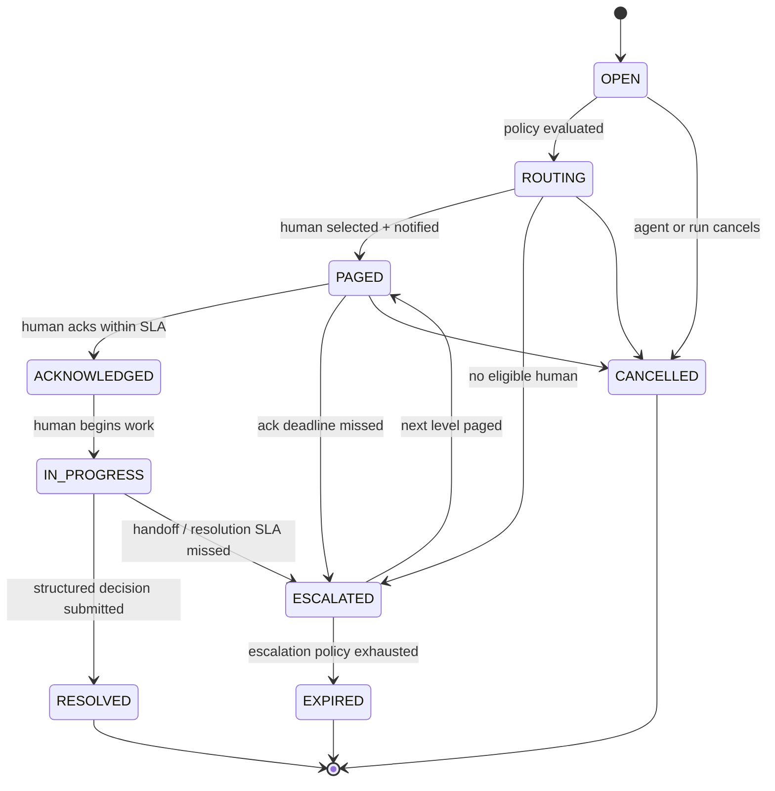

# BotHandlers — Vision

**A human-in-the-loop management platform.**

BotHandlers is a production-ready, multi-tenant SaaS that acts as the human-intervention
infrastructure layer for autonomous AI agents. When an agent hits an exception, an
uncertainty, a policy boundary, or an action it is not authorized to take, BotHandlers
routes that moment to the right business human, reliably obtains a structured decision,
and hands it back so the agent can resume.

---

## 1. The Problem

AI agents increasingly execute real business workflows end to end — refunds, procurement,
fraud review, supply-chain adjustments, HR and legal steps. They are good at the 95% path.
They are not trusted with, and often not authorized for, the remaining 5%:

- an **exception** the workflow did not anticipate,
- **uncertainty** the model cannot resolve on its own,
- a **policy boundary** (spend limits, compliance, jurisdiction),
- an **unauthorized action** requiring delegated human authority.

Today every team rebuilds this ad hoc: a Slack ping into a channel nobody owns, an email to
a shared inbox, a hardcoded `if confidence < 0.8: pause()` with no follow-through. The
result is silently dropped decisions, unbounded stall time, no accountability, and no audit
trail. The agent stops; nobody knows whose job it is to unblock it.

**BotHandlers makes "an agent needs a human" a first-class, reliable, observable event.**

---

## 2. What BotHandlers Is

A framework-independent infrastructure layer that:

1. Accepts an **intervention request** from any agent, in any framework, over REST/SDK/MCP.
2. Evaluates **policy** to decide whether and how a human must be involved.
3. **Routes** to the right human by team, skill, authority, availability, on-call schedule and workload.
4. **Pages** that human through their channels, with acknowledgement deadlines and SLA timers.
5. **Escalates** automatically when nobody acknowledges in time.
6. Presents a **plain-language inbox** to non-technical business operators.
7. Captures a **structured decision** — richer than approve/reject.
8. **Delivers that decision back** to the originating agent with at-least-once guarantees.
9. Records an **immutable audit trail** of every step.
10. Stores enough history to eventually tell an organization **which interventions no longer need a human.**

### What BotHandlers Is Not

Explicit non-goals. We do not build:

- an agent framework or agent builder,
- a ticketing system or helpdesk,
- a project manager or task tracker,
- a CRM,
- an external-human / gig marketplace.

BotHandlers coordinates **an organization's existing business humans** when its autonomous
systems need intervention. Nothing more.

---

## 3. The Fundamental Workflow

```
AI Agent
   → Human Intervention Request
   → Policy Evaluation
   → Skill / Authority Routing
   → On-Call Human
   → Page
   → Acknowledge
   → Human Decision
   → Agent Resume
```

If the assigned human does not acknowledge within the configured SLA, BotHandlers
automatically escalates to the next eligible person.

The humans on the receiving end are **business operators**, not engineers: finance
operators, customer-support agents, fraud analysts, procurement managers, supply-chain
planners, HR, legal, operations managers.

---

## 4. The Central Domain Object: `Intervention`

Everything in the system orbits one object. An Intervention carries:

**Identity & origin**
- `organization` — tenant that owns it
- `agent` — which agent (and version) raised it
- `external_run_id` — the agent's own run/thread identifier, for correlation

**The situation**
- `title` — one line a non-technical human understands
- `description` — what happened, in business language
- `severity`
- `business_context` — the records, amounts, customers, orders involved
- `agent_recommendation` — what the agent would do if allowed
- `confidence` — how sure the agent is

**What is being asked of the human**
- `requested_action` — the decision required
- `response_schema` — the structured shape of a valid answer

**Routing requirements**
- `required_team`
- `required_skills`
- `required_authority` — e.g. approve transactions ≤ ₹500,000

**Timing & ownership**
- `sla` — acknowledgement and resolution deadlines
- `assigned_human`
- `escalation_policy`

**Return path**
- `callback` — signed webhook target and delivery state

**State**
- `timestamps`, `status`, `final_decision`

---

## 5. Lifecycle State Machine

```
OPEN → ROUTING → PAGED → ACKNOWLEDGED → IN_PROGRESS → RESOLVED
```

With additional terminal and branch states: **ESCALATED**, **EXPIRED**, **CANCELLED**.



Every transition is an audited event. The state machine is the contract: an intervention is
never in an ambiguous state, and never stalls without a timer attached to it.

---

## 6. The Routing Engine

Routing must be **explainable**. For any intervention, an operations manager can ask "why
did this go to Priya?" and get a concrete answer, not a black box score.

Selection inputs:

- **Team** — the organizational unit responsible
- **Skills** — capabilities the intervention requires
- **Authority** — what this person is empowered to decide
- **Availability** — working hours, presence, time zone
- **On-call schedule** — who is actually holding the pager right now
- **Workload** — how many open interventions they already carry

### Authority is independent from RBAC

This is a core design commitment. RBAC governs *what you can do in BotHandlers* (view,
configure, administer). Authority governs *what business decisions you are empowered to
make*. Someone may belong to the Finance team, hold the Operator role, and still only have
authority to approve transactions below ₹500,000. Above that threshold they are not an
eligible assignee at all — routing must skip them, and escalation must climb to someone
whose authority actually covers the amount.

Authority is modeled as scoped, parameterized limits — not as a role name.

---

## 7. On-Call, SLA and Escalation

PagerDuty-grade operational primitives, because reliability here is the product:

- **On-call schedules** with rotations (daily, weekly, custom)
- **Overrides** for leave, handoffs and coverage gaps
- **Acknowledgement deadlines** per intervention
- **SLA timers** for both acknowledge and resolve
- **Fallback users** when a schedule resolves to nobody
- **Multi-level escalation policies** that climb through people, teams and authority tiers

An unacknowledged intervention is a failure mode the system is designed to detect and
correct automatically, not a state it is allowed to sit in.

---

## 8. Integration Surface

### Core: framework-independent

A clean **REST API** and a **Python SDK** are the primary contract. Any agent, in any
language or framework, can create an intervention and receive a decision.

### Thin framework adapters

Ship first:
- **LangGraph**
- **OpenAI Agents SDK**

Architected so these follow without core changes: **CrewAI, PydanticAI, AutoGen, Google ADK,
n8n, Temporal**, and custom agents.

Adapters stay thin by design. All logic lives in the core; adapters only translate.

### MCP surface

BotHandlers is also exposed over MCP with human-in-the-loop primitives:

| Primitive | Purpose |
|---|---|
| `human.request` | Generic intervention request |
| `human.review` | Ask a human to review agent output |
| `human.choose` | Present options, get a selection |
| `human.approve` | Approval gate |
| `human.request_information` | Ask the human for missing input |
| `human.takeover` | Hand the task to a human entirely |
| `human.escalate` | Force escalation |
| `human.status` | Poll intervention state |

---

## 9. Structured Decisions, Not Just Approve/Reject

Agents supply a `response_schema` when creating an intervention. The human response is
structured and can be far richer than a binary:

- `APPROVE`
- `REJECT`
- `MODIFY` — with the modified values
- `REQUEST_MORE_INFORMATION`

…plus arbitrary structured fields defined by the schema (a corrected amount, a chosen
vendor, a reason code, free-text rationale). The UI renders the schema into a form a
non-technical operator can complete without knowing it is a schema at all.

---

## 10. Reliable Return Path

**A human decision must never be silently lost.** After resolution, the structured decision
is delivered back to the originating agent via a **signed webhook/callback**, with:

- **Retries** with exponential backoff
- **Idempotency** keys so redelivery is safe
- **Delivery status** visible in the UI and API
- Signature verification so the agent can trust the payload's origin

Undeliverable callbacks are surfaced as an operational problem, not swallowed.

---

## 11. The Human Experience

Designed for **non-technical business operators**. The guiding constraint:

> Humans should never need to understand LLMs, agent frameworks, MCP, callbacks or
> orchestration.

### Intervention Inbox

Views:
- **Assigned to Me**
- **Unacknowledged**
- **In Progress**
- **Escalated**
- **Resolved**

### Every intervention answers, at a glance:

1. **What happened** — in business language
2. **Why the agent needs a human** — the boundary it hit
3. **What the agent recommends** — and how confident it is
4. **Relevant business context** — the actual records and amounts
5. **What decision is required** — the form to fill
6. **How much time remains** — a visible SLA countdown

It should feel like a simple inbox. Nothing more exotic than that.

---

## 12. Notifications

Launch with **email** and **Slack**. Build behind a **provider abstraction** so the
following can be added without touching the core: **Microsoft Teams, SMS, WhatsApp, push,
voice**.

---

## 13. Audit Trail

Every event produces an **immutable audit entry**:

- intervention creation
- routing decisions (including why each candidate was chosen or skipped)
- pages
- acknowledgements
- escalations
- decisions
- callback attempts and outcomes
- resolution

Each entry records **who** performed the action, **when** it happened, and relevant
**metadata**. This is what makes agent autonomy defensible to compliance, finance and legal.

---

## 14. Analytics

Operational and strategic metrics:

- Intervention volume
- **Human-intervention rate** (share of agent runs needing a human)
- **MTTA** — Mean Time To Acknowledge
- **MTTR** — Mean Time To Resolve
- SLA compliance
- Escalation rate
- Interventions by agent, team and operator
- Common escalation reasons
- **Agent confidence vs. human decision** — where the agent was right and nobody trusted it,
  and where it was confidently wrong

---

## 15. The Long Game: An Autonomy Control Plane

Store enough historical information that BotHandlers can eventually identify **repetitive
interventions that could safely become autonomous**:

- agent and agent version
- the situation
- the context
- the agent's recommendation
- the agent's confidence
- which human was selected
- the human's decision
- the eventual outcome

**Do not automate this in V1.** The V1 obligation is only to design the data model so this
evolution is possible without a migration rewrite. The eventual product question —
*"which 5% is still really 5%, and which has quietly become 0%?"* — is the reason this data
shape matters from day one.

---

## 16. Security & Multi-Tenancy

- **Multi-tenancy** with strict organization isolation
- **RBAC**
- **API keys** for agent authentication
- **Encrypted secrets**
- **Signed webhooks**
- **Rate limiting**
- **Comprehensive audit logging**

### Initial roles

| Role | Purpose |
|---|---|
| Organization Admin | Full configuration and tenant administration |
| Agent Developer | Registers agents, manages API keys and integrations |
| Operations Manager | Owns schedules, escalation policies, routing configuration |
| Operator | Receives and resolves interventions |
| Auditor | Read-only access to audit trail and analytics |

Reminder: **roles are not authority.** See §6.

---

## 17. Technology & Architecture

**Language:** TypeScript across backend, frontend, infrastructure and SDK
**Backend:** AWS Lambda + API Gateway + DynamoDB + SQS + EventBridge Scheduler
**Frontend:** Next.js + TypeScript; React Native + Expo for mobile
**Infrastructure:** Pulumi, on AWS
**Architecture:** serverless and event-driven

The serverless choice follows from the shape of the workload. An intervention is created,
and then the system waits — minutes, sometimes hours — for a human. Paying for idle capacity
to wait on people is the wrong cost shape. The waiting is done by **durable state plus a
timer**, never by a running process.

The load-bearing consequence: **a request handler must never wait for a human.** State is
persisted, work is enqueued, the invocation exits. The human responds later, and that
response is a new event.

DynamoDB is the source of truth, modeled from access patterns, with conditional writes
providing the exactly-one-outcome guarantee when two humans act simultaneously. SQS carries
asynchronous work with at-least-once delivery, so every consumer is idempotent. EventBridge
Scheduler carries the acknowledgement and escalation deadlines, so every timer must tolerate
firing late or after the situation it was scheduled for has already resolved.

Python remains a first-class citizen at the edge: the Python SDK is a primary deliverable,
because the agent ecosystem it must serve is predominantly Python.

Full technical detail — data model, state machine, routing algorithm, API surface and
delivery guarantees — lives in [`architecture.md`](./architecture.md).

---

## Billing Model

BotHandlers is billed by active human seats feeding a shared, organization-wide intervention pool. Directory provisioning is separated from seat assignment, and connected agents are not billed. See [`architecture.md` §22](./architecture.md#22-billing-and-seat-model) for the normative pricing model and overage behavior.

---

## 18. Design North Stars

| Dimension | Standard to match |
|---|---|
| Developer experience | **Stripe** — clear API, great SDK, obvious errors, docs you can act on |
| Operational reliability | **PagerDuty** — nothing gets dropped, everything has an owner and a timer |
| Human experience | **A simple inbox** — no jargon, no orchestration concepts, just a decision to make |

---

## 19. Build Order

Design first, then implement the MVP:

1. **Architecture**
2. **Database schema**
3. **APIs**
4. **State machine**
5. **Routing algorithm**
6. **Repository structure**
7. **MVP implementation**

### The one critical end-to-end path

Everything is optimized around this single flow working reliably:

```
Agent raises intervention
  → BotHandlers identifies the right human
  → pages them
  → human acknowledges
  → human decides
  → BotHandlers returns the structured decision
  → agent resumes
  → complete audit trail
```

**Do not over-engineer secondary functionality until this flow works reliably end to end.**

Concretely, that means V1 defers: additional notification providers beyond email and Slack,
frameworks beyond LangGraph and OpenAI Agents SDK, autonomy recommendations, advanced
analytics dashboards, `apps/mobile/` (deferred until push notification becomes a requirement), and any workflow feature that does not appear on the critical path
above.

---

## 20. Open Questions

Tracked, to be resolved during architecture design:

- How is `response_schema` expressed and versioned (JSON Schema subset?), and how does the
  UI render it for non-technical operators?
- How is authority modeled generically enough to cover monetary limits, jurisdictions,
  customer tiers and record classes without becoming a rules engine?
- Do agents poll, hold a connection, or rely solely on callbacks — and what does the SDK
  present as the default ergonomic (blocking call vs. resumable token)?
- Where does policy evaluation sit relative to routing, and is it configuration or code in V1?
- How far can a single tenant's active-intervention volume grow before the base partition
  needs sharding, and what is the migration path when it does?
- How are on-call schedules represented such that overrides, rotations and time zones stay
  correct and testable?
- What is the retention policy for business context that may contain PII?
